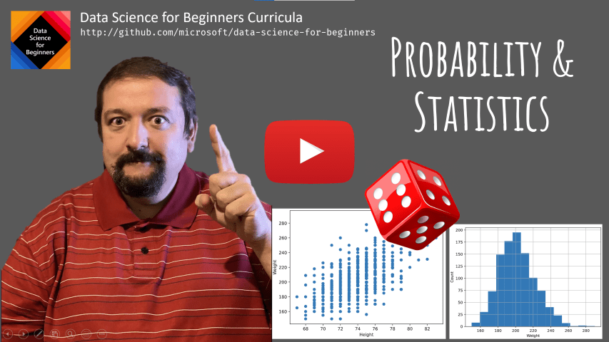
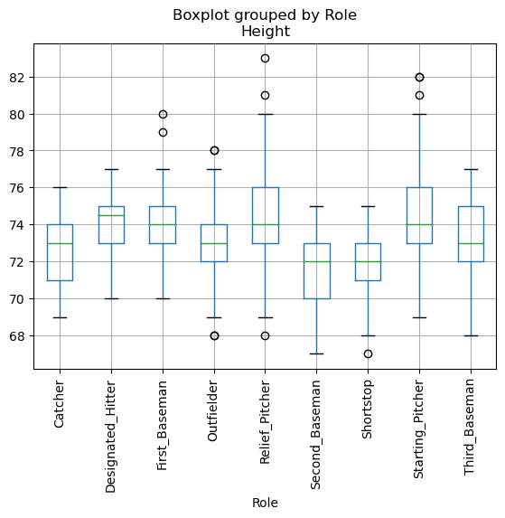
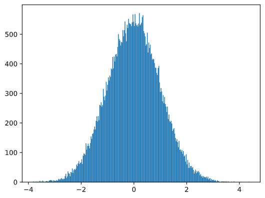
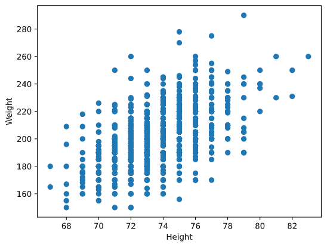

# 통계 및 확률에 대한 간략한 소개

| ](../../../sketchnotes/04-Statistics-Probability.png)|
|:---:|
| 통계 및 확률 - _[@nitya](https://twitter.com/nitya)_ 의 스케치노트 |

통계 및 확률 이론은 데이터 과학과 매우 관련성이 높은 수학 영역입니다. 수학에 대한 깊은 지식이 없어도 데이터로 작업하는 것은 가능하지만 최소한 몇 가지 기본 개념은 알고 있는 것이 좋습니다. 이 장에서 통계 및 확률을 시작하는 데 도움이 되는 간단한 소개를 제공합니다.

[](https://youtu.be/Z5Zy85g4Yjw)


## [강의전 퀴즈](https://witty-beach-04b13e603.1.azurestaticapps.net/quiz/6)

## 확률과 랜덤 변수

**확률**은 **사건**의 확률을 나타내는 0과 1 사이의 숫자입니다. 모든 결과의 가능성이 동일할 경우 이벤트로 이어지는 긍정적인 결과의 수를 총 결과 수로 나눈 값으로 정의됩니다. 예를 들어, 주사위를 굴릴 때 짝수가 나올 확률은 3/6 = 0.5입니다.

이벤트에 대해 이야기할 때 **임의 변수**를 사용합니다. 예를 들어, 주사위를 던질 때 얻은 숫자를 나타내는 확률 변수는 1에서 6까지의 값을 취합니다. 1에서 6까지의 숫자 집합을 **샘플 공간**이라고 합니다. 예를 들어 P(X=3)=1/6과 같이 임의의 변수가 특정 값을 취할 확률에 대해 이야기할 수 있습니다.

이전 예의 확률 변수는 셀 수 있는 샘플 공간, 즉 열거할 수 있는 별도의 값이 있기 때문에 **이산**이라고 합니다. 표본 공간이 실수의 범위이거나 실수의 전체 집합인 경우가 있습니다. 이러한 변수를 **연속**이라고 합니다. 좋은 예는 버스가 도착하는 시간입니다.

## 확률 분포

이산 확률 변수의 경우 각 이벤트의 확률을 함수 P(X)로 설명하기 쉽습니다. 샘플 공간 *S*의 각 값 *s*에 대해 모든 이벤트에 대한 P(X=s)의 모든 값의 합이 1이 되도록 0에서 1까지의 숫자를 제공합니다.

가장 잘 알려진 이산 분포는 **균일 분포**로, 각 요소에 대해 동일한 확률이 1/N인 N 요소의 표본 공간이 있습니다.

일부 구간 [a,b]에서 가져온 값 또는 실수 &Ropf의 전체 집합을 사용하여 연속 변수의 확률 분포를 설명하는 것이 더 어렵습니다. 버스 도착 시간의 경우를 고려하십시오. 실제로 각 정확한 도착 시간 *t*에 대해 버스가 정확히 그 시간에 도착할 확률은 0입니다!

> 이제 확률이 0인 이벤트가 매우 자주 발생한다는 것을 알았습니다! 적어도 버스가 도착할 때마다!

예를 들어 주어진 값 간격에 변수가 떨어질 확률에 대해서만 이야기할 수 있습니다. P(t<sub>1</sub>&le;X<t<sub>2</sub>). 이 경우 확률 분포는 **확률 밀도 함수** p(x)로 다음과 같이 설명됩니다.


  
균일 분포의 연속 아날로그는 유한 간격으로 정의되는 **연속 균일**이라고 합니다. 값 X가 길이 l의 구간에 들어갈 확률은 l에 비례하고 1까지 올라갑니다.

또 다른 중요한 분포는 **정규 분포**입니다. 이에 대해서는 아래에서 더 자세히 설명하겠습니다.

## 평균, 분산 및 표준 편차

확률 변수 X의 n개 샘플 시퀀스를 그린다고 가정합니다: x<sub>1</sub>, x<sub>2</sub>, ..., x<sub>n</sub>. 우리는 전통적인 방식으로 시퀀스의 **mean**(또는 **산술 평균**) 값을 다음과 같이 정의할 수 있습니다. (x<sub>1</sub>+x<sub>2</sub>+x<sub >n</sub>)/n. 표본의 크기를 늘리면(즉, n&rarr;&infin;으로 극한을 취함) 분포의 평균(**기대값**이라고도 함)을 얻게 됩니다. 기대치를 **E**(x)로 표시합니다.

> 값이 {x<sub>1</sub>, x<sub>2</sub>, ..., x<sub>N</sub>}이고 해당 확률이 있는 이산 분포의 경우 p<sub>1</sub>, p<sub>2</sub>, ..., p<sub>N</sub>, 기대값은 E(X)=x<sub>1< /sub>p<sub>1</sub>+x<sub>2</sub>p<sub>2</sub>+...+x<sub>N</sub>p<sub>N </sub>.

값이 얼마나 퍼져 있는지 식별하기 위해 분산 sigma;<sup>2</sup> = &sum;(x<sub>i</sub> - &mu;)<sup>2</sup>/를 계산할 수 있습니다. n, 여기서 &mu; 수열의 평균입니다. 가치 σ; **표준편차**라고 하고 sigma;<sup>2</sup>를 **분산**이라고 합니다.

## 모드(Mode), 중앙값(Median) 및 사분위수(Quartiles)

때때로 평균은 데이터의 "일반적인" 값을 적절하게 나타내지 않습니다. 예를 들어, 범위를 완전히 벗어난 극단값이 몇 개 있는 경우 평균에 영향을 줄 수 있습니다. 또 다른 좋은 표시는 데이터 포인트의 절반이 그보다 낮고 다른 절반은 더 높은 값인 **중앙값**입니다.

데이터 분포를 이해하는 데 도움이 되도록 **사분위수**에 대해 이야기하는 것이 좋습니다.

* 1사분위수 또는 Q1은 데이터의 25%가 그 아래로 떨어지는 값입니다.
* 3사분위수 또는 Q3은 데이터의 75%가 그 아래에 속하는 값입니다.

**박스 플롯**이라는 다이어그램에서 중앙값과 사분위수 간의 관계를 그래픽으로 나타낼 수 있습니다.


여기에서 **사분위수 범위** IQR=Q3-Q1 및 소위 **이상치** - 경계 외부에 있는 값[Q1-1.5*IQR,Q3+1.5*IQR]도 계산합니다.

적은 수의 가능한 값을 포함하는 유한 분포의 경우 좋은 "전형적인" 값이 가장 자주 나타나는 값이며, 이를 **모드(Mode)**라고 합니다. 색상과 같은 범주형 데이터에 자주 적용됩니다. 빨간색을 강하게 선호하는 사람과 파란색을 선호하는 사람의 두 그룹이 있는 상황을 생각해 보십시오. 색상을 숫자로 코딩하면 좋아하는 색상의 평균 값은 주황색-녹색 스펙트럼의 어딘가에 있을 것이며, 이는 어느 그룹의 실제 선호도를 나타내지 않습니다. 그러나 모드는 투표하는 사람들의 수가 같을 경우 색상 중 하나 또는 두 색상 모두가 됩니다(이 경우 샘플 **다중 모드**라고 함).
## 실제 데이터

실생활의 데이터를 분석할 때 결과를 알 수 없는 실험을 하지 않는다는 의미에서 확률변수가 아닌 경우가 많습니다. 예를 들어, 야구 선수로 구성된 팀과 키, 체중 및 나이와 같은 신체 데이터를 고려하십시오. 그 숫자는 정확히 무작위가 아니지만 여전히 동일한 수학적 개념을 적용할 수 있습니다. 예를 들어, 사람들의 가중치 시퀀스는 임의의 변수에서 가져온 값 시퀀스로 간주될 수 있습니다. 아래는 [이 데이터셋](http://wiki.stat.ucla.edu)에서 가져온 [메이저리그 야구](http://mlb.mlb.com/index.jsp)의 실제 야구 선수들의 가중치 순서입니다. /socr/index.php/SOCR_Data_MLB_HeightsWeights) (편의를 위해 처음 20개 값만 표시됨):

```
[180.0, 215.0, 210.0, 210.0, 188.0, 176.0, 209.0, 200.0, 231.0, 180.0, 188.0, .0, 180.0, 188.0, 180.0, 185.0, 180.5
```

> **참고**: 이 데이터셋으로 작업하는 예를 보려면 [노트북 파일](../notebook.ipynb)을 살펴보세요. 또한 이 단원에는 여러 가지 문제가 있으며 해당 노트북에 몇 가지 코드를 추가하여 완료할 수 있습니다. 데이터 작업 방법이 확실하지 않은 경우 걱정하지 마세요. 나중에 Python을 사용하여 데이터 작업으로 다시 돌아올 것입니다. Jupyter Notebook에서 코드를 실행하는 방법을 모른다면 [이 기사](https://soshnikov.com/education/how-to-execute-notebooks-from-github/)를 참조하십시오.

다음은 데이터의 평균, 중앙값 및 사분위수를 보여주는 상자 그림입니다.


우리 데이터에는 다양한 플레이어 **역할**에 대한 정보가 포함되어 있기 때문에 역할별로 상자 그림을 그릴 수도 있습니다. 이를 통해 매개변수 값이 역할에 따라 어떻게 다른지에 대한 아이디어를 얻을 수 있습니다. 이번에는 높이를 고려할 것입니다.



이 도표는 평균적으로 1루수의 키가 2루수의 키보다 높다는 것을 암시합니다. 이 수업의 뒷부분에서 우리는 이 가설을 보다 공식적으로 테스트하는 방법과 우리의 데이터가 이를 보여주기 위해 통계적으로 유의하다는 것을 증명하는 방법을 배울 것입니다.

> 실제 데이터로 작업할 때 모든 데이터 포인트는 일부 확률 분포에서 추출한 샘플이라고 가정합니다. 이 가정을 통해 우리는 기계 학습 기술을 적용하고 작동하는 예측 모델을 구축할 수 있습니다.

데이터 분포를 확인하기 위해 **히스토그램**이라는 그래프를 그릴 수 있습니다. X축은 다양한 가중치 간격(소위 **빈**)을 포함하고 세로축은 랜덤 변수 샘플이 주어진 간격 내에 있는 횟수를 표시합니다.


이 히스토그램에서 모든 값이 특정 평균 가중치의 중심에 있고 해당 가중치에서 멀어질수록 해당 값의 가중치가 더 적음을 알 수 있습니다. 즉, 야구 선수의 체중이 평균 체중과 크게 다를 가능성은 매우 낮습니다. 가중치의 분산은 가중치가 평균과 다를 가능성이 있는 정도를 나타냅니다.

> 야구리그가 아닌 타인의 가중치를 취하면 분포가 달라질 가능성이 높다. 그러나 분포의 모양은 동일하지만 평균과 분산은 변경됩니다. 따라서 야구 선수를 대상으로 모델을 훈련하면 기본 분포가 다르기 때문에 대학 학생에게 적용하면 잘못된 결과가 나올 수 있습니다.
## 정규 분포

위에서 본 가중치 분포는 매우 일반적이며 실제 세계의 많은 측정값은 동일한 유형의 분포를 따르지만 평균과 분산은 다릅니다. 이 분포를 **정규 분포**라고 하며 통계에서 매우 중요한 역할을 합니다.

정규 분포를 사용하는 것은 잠재적인 야구 선수의 무작위 가중치를 생성하는 올바른 방법입니다. 평균 가중치 'mean'과 표준 편차 'std'를 알게 되면 다음과 같은 방식으로 1000개의 가중치 샘플을 생성할 수 있습니다.
```파이썬
샘플 = np.random.normal(mean,std,1000)
```

생성된 샘플의 히스토그램을 플롯하면 위에 표시된 것과 매우 유사한 그림을 볼 수 있습니다. 샘플 수와 빈 수를 늘리면 이상에 더 가까운 정규 분포 그림을 생성할 수 있습니다.



*mean=0 및 std.dev=1인 정규 분포*

## 신뢰 구간

야구 선수의 체중에 대해 이야기할 때 모든 야구 선수(소위 **인구**)의 체중에 대한 이상적인 확률 분포에 해당하는 특정 **무작위 변수 W**가 있다고 가정합니다. 가중치 시퀀스는 **샘플**이라고 하는 모든 야구 선수의 하위 집합에 해당합니다. 흥미로운 질문은 W 분포의 매개변수, 즉 모집단의 평균과 분산을 알 수 있습니까?

가장 쉬운 대답은 표본의 평균과 분산을 계산하는 것입니다. 그러나 무작위 표본이 전체 모집단을 정확하게 나타내지 않을 수 있습니다. 따라서 **신뢰 구간**에 대해 이야기하는 것이 좋습니다.

> **신뢰 구간**은 표본이 제공된 모집단의 실제 평균 추정치로, 특정 확률(또는 **신뢰 수준**)이 정확합니다.

분포에서 샘플 X<sub>1</sub>, ..., X<sub>n</sub>이 있다고 가정합니다. 분포에서 표본을 추출할 때마다 다른 평균값 μ가 됩니다. 따라서 뮤; 확률변수라고 할 수 있습니다. 신뢰 p가 있는 **신뢰 구간**은 값 쌍(L<sub>p</sub>,R<sub>p</sub>)입니다. **P**(L<sub>p </sub><leq;&mu;&leq;R<sub>p</sub>) = p, 즉 측정된 평균값이 구간 내에 포함될 확률은 p와 같습니다.

이러한 신뢰 구간을 계산하는 방법에 대해 자세히 설명하는 것은 짧은 소개를 넘어서는 것입니다. 더 자세한 내용은 [위키피디아](https://en.wikipedia.org/wiki/Confidence_interval)에서 찾을 수 있습니다. 간단히 말해서, 모집단의 실제 평균을 기준으로 계산된 표본 평균의 분포를 정의하며, 이를 **학생 분포**라고 합니다.

> **흥미로운 사실**: 학생 분포는 "학생"이라는 가명으로 논문을 발표한 수학자 William Sealy Gosset의 이름을 따서 명명되었습니다. 그는 기네스 양조장에서 일했으며 버전 중 하나에 따르면 그의 고용주는 일반 대중이 원료의 품질을 결정하기 위해 통계적 테스트를 사용하고 있다는 사실을 알기를 원하지 않았습니다.

평균 &mu; 우리 모집단의 p를 신뢰하는 경우, 학생 분포 A의 *(1-p)/2-백분위수*를 가져와야 합니다. 이는 테이블이나 통계 소프트웨어의 일부 내장 기능을 사용하는 컴퓨터에서 가져올 수 있습니다(예: .파이썬, R 등). 그런 다음 &mu; X&pm;A*D/&radic;n으로 주어지며, 여기서 X는 샘플의 얻은 평균, D는 표준 편차입니다.

> **참고**: 학생 배포와 관련하여 중요한 [자유도](https://en.wikipedia.org/wiki/Degrees_of_freedom_(statistics))의 중요한 개념에 대한 논의도 생략합니다. 이 개념을 더 깊이 이해하려면 통계에 대한 더 완전한 책을 참조할 수 있습니다.

몸무게와 키에 대한 신뢰구간을 계산하는 예시는 [첨부노트](../notebook.ipynb)에 나와 있습니다.

| 피 | 무게 평균 |
|-----|-----------|
| 0.85 | 201.73±0.94 |
| 0.90 | 201.73±1.08 |
| 0.95 | 201.73±1.28 |

신뢰 확률이 높을수록 신뢰 구간이 넓어집니다.

## 가설 검증

야구 선수 데이터셋에는 다양한 선수 역할이 있으며 아래에 요약할 수 있습니다(이 표를 계산하는 방법을 보려면 [첨부 노트](../notebook.ipynb) 참조).

| 역할 | 높이 | 무게 | 카운트 |
|---------|--------|--------|-------|
| 포수 | 72.723684 | 204.328947 | 76 |
| 지명타자 | 74.222222 | 220.888889 | 18 |
| 퍼스트_루수 | 74.000000 | 213.109091 | 55 |
| 외야수 | 73.010309 | 199.113402 | 194 |
| Relief_Pitcher | 74.374603 | 203.517460 | 315 |
| Second_Baseman | 71.362069 | 184.344828 | 58 |
| 유격수 | 71.903846 | 182.923077 | 52 |
| 시작_투수 | 74.719457 | 205.163636 | 221 |
| Third_Baseman | 73.044444 | 200.955556 | 45 |

1루수의 평균 신장이 2루수의 평균 신장보다 높다는 것을 알 수 있습니다. 따라서 우리는 **1루수가 2루수보다 높다**라는 결론을 내릴 수 있습니다.

> 사실이 사실인지 아닌지 알 수 없기 때문에 이 진술을 **가설**이라고 합니다.

그러나 우리가 이러한 결론을 내릴 수 있는지 여부가 항상 분명한 것은 아닙니다. 위의 논의에서 우리는 각 평균에 연관된 신뢰 구간이 있다는 것을 알고 있으므로 이 차이는 단지 통계적 오류일 수 있습니다. 우리는 우리의 가설을 검증하기 위해 좀 더 공식적인 방법이 필요합니다.

1루수와 2루수 키에 대한 신뢰 구간을 별도로 계산해 보겠습니다.

| 자신감 | 1루수 | 2루수 |
|------------|------------------|----------------|
| 0.85 | 73.62..74.38 | 71.04..71.69 |
| 0.90 | 73.56..74.44 | 70.99..71.73 |
| 0.95 | 73.47..74.53 | 70.92..71.81 |

신뢰하지 않는 경우 구간이 겹치는 것을 볼 수 있습니다. 이것은 1루수가 2루수보다 높다는 우리의 가설을 증명합니다.

보다 공식적으로, 우리가 해결하는 문제는 **두 개의 확률 분포가 동일한지** 또는 최소한 동일한 매개변수를 갖는지 확인하는 것입니다. 분포에 따라 다른 테스트를 사용해야 합니다. 분포가 정상이라는 것을 안다면 **[Student t-test](https://en.wikipedia.org/wiki/Student%27s_t-test)** 를 적용할 수 있습니다.

스튜던트 t-검정에서는 분산을 고려하여 평균 간의 차이를 나타내는 소위 **t-값**을 계산합니다. t-값은 **학생 분포**를 따르며, 이를 통해 주어진 신뢰 수준 **p**에 대한 임계값을 얻을 수 있습니다(이는 계산하거나 숫자 표에서 조회할 수 있음). 그런 다음 t-값을 이 임계값과 비교하여 가설을 승인하거나 기각합니다.

파이썬에서는 `ttest_ind` 기능을 포함하는 **SciPy** 패키지를 사용할 수 있습니다(다른 많은 유용한 통계 기능 외에도!). 그것은 우리를 위해 t-값을 계산하고 또한 신뢰 p-값의 역 조회를 수행하여 우리가 결론을 도출하기 위해 신뢰를 볼 수 있도록 합니다.

예를 들어, 1루수와 2루수의 키를 비교하면 다음과 같은 결과가 나옵니다.
```파이썬
scipy.stats에서 ttest_ind 가져오기

tval, pval = ttest_ind(df.loc[df['역할']=='First_Baseman',['신장']], df.loc[df['역할']=='지정된_히터',['신장'] ],equal_var=거짓)
print(f"T 값 = {tval[0]:.2f}\nP 값: {pval[0]}")
```
```
T-값 = 7.65
P-값: 9.137321189738925e-12
```
우리의 경우 p-값이 매우 낮습니다. 이는 1루수가 키가 크다는 강력한 증거가 있음을 의미합니다.

테스트할 수 있는 다른 유형의 가설도 있습니다. 예를 들면 다음과 같습니다.
* 주어진 표본이 어떤 분포를 따른다는 것을 증명하기 위해. 우리의 경우 높이가 정규 분포라고 가정했지만 공식적인 통계 검증이 필요합니다.
* 표본의 평균값이 미리 정의된 값과 일치함을 증명하기 위해
* 여러 표본의 평균을 비교하기 위해(예: 연령대에 따른 행복 수준의 차이)

## 대수의 법칙과 중심극한정리

정규 분포가 중요한 이유 중 하나는 소위 **중심극한 정리**입니다. 평균이 &mu인 분포에서 샘플링된 독립적인 N 값 X<sub>1</sub>, ..., X<sub>N</sub>의 큰 샘플이 있다고 가정합니다. 및 분산 σ<sup>2</sup>. 그런 다음 충분히 큰 N에 대해(즉, N<sub>i</sub>X<sub>i</sub>인 경우) 평균 Σ<sub>i</sub>는 정규 분포를 따르고 평균은 Δmu; 및 분산 σ<sup>2</sup>/N.

> 중심극한정리를 해석하는 또 다른 방법은 분포에 관계없이 임의의 변수 값의 합계의 평균을 계산할 때 정규 분포로 끝나는 것이라고 말하는 것입니다.

중심극한정리로부터, N''일 때, 표본 평균의 확률은 α와 같다는 것이 또한 따른다. 1이 됩니다. 이것은 **대수의 법칙**으로 알려져 있습니다.

## 공분산과 상관

데이터 과학이 하는 일 중 하나는 데이터 간의 관계를 찾는 것입니다. 두 시퀀스가 ​​동시에 유사한 동작을 나타낼 때 **상관관계**가 있다고 말합니다. 즉, 동시에 상승/하강하거나, 다른 시퀀스가 ​​떨어질 때 한 시퀀스가 ​​상승하고 그 반대의 경우도 마찬가지입니다. 즉, 두 시퀀스 사이에 어떤 관계가 있는 것 같습니다.

> 상관 관계가 반드시 두 시퀀스 간의 인과 관계를 나타내는 것은 아닙니다. 때로는 두 변수 모두 외부 원인에 따라 달라질 수 있거나 순전히 우연히 두 시퀀스가 ​​상관 관계가 있을 수 있습니다. 그러나 강한 수학적 상관관계는 두 변수가 어떻게든 연결되어 있다는 좋은 표시입니다.

 수학적으로 두 확률 변수 간의 관계를 보여주는 주요 개념은 **공분산**이며 다음과 같이 계산됩니다. Cov(X,Y) = **E**\[(X-**E**(X) ))(Y-**E**(Y))\]. 평균값에서 두 변수의 편차를 계산한 다음 해당 편차의 곱을 계산합니다. 두 변수가 함께 벗어나면 제품은 항상 양수 값이 되어 양의 공분산이 됩니다. 두 변수가 동기화되지 않은 상태에서 벗어나면(즉, 하나는 평균 아래로 떨어지고 다른 하나는 평균 이상으로 상승하는 경우) 항상 음수를 얻게 되며, 이는 합산하여 음의 공분산이 됩니다. 편차가 종속적이지 않은 경우 합산하면 대략 0이 됩니다.

공분산의 절대 값은 실제 값의 크기에 따라 달라지기 때문에 상관 관계가 얼마나 큰지 알려주지 않습니다. 정규화하기 위해 공분산을 두 변수의 표준 편차로 나누어 **상관**을 얻을 수 있습니다. 좋은 점은 상관 관계가 항상 [-1,1] 범위에 있다는 것입니다. 여기서 1은 값 간의 강한 양의 상관 관계를 나타내고, -1 - 강한 음의 상관 관계를 나타내고, 0 - 상관 관계가 전혀 없음(변수는 독립적임)을 나타냅니다.

**예**: 위에서 언급한 데이터셋에서 야구 선수의 체중과 키 간의 상관 관계를 계산할 수 있습니다.
```파이썬
print(np.corrcoef(무게, 높이))
```
결과적으로 다음과 같은 **상관 행렬**을 얻습니다.
```
배열([[1. , 0.52959196],
       [0.52959196, 1. ]])
```

> 상관 행렬 C는 입력 시퀀스 S<sub>1</sub>, ..., S<sub>n</sub>의 개수에 관계없이 계산할 수 있습니다. C<sub>ij</sub>의 값은 S<sub>i</sub>와 S<sub>j</sub> 사이의 상관 관계이며 대각선 요소는 항상 1입니다(이는 S<sub>i</sub>).

우리의 경우 값 0.53은 사람의 체중과 키 사이에 약간의 상관 관계가 있음을 나타냅니다. 관계를 시각적으로 보기 위해 다른 값에 대한 한 값의 산점도를 만들 수도 있습니다.



> [첨부노트](../notebook.ipynb)에서 상관관계와 공분산의 더 많은 예를 볼 수 있습니다.

## 결론

이 섹션에서는 다음을 배웠습니다.

* 평균, 분산, 모드 및 사분위수와 같은 데이터의 기본 통계 속성
* 정규 분포를 포함한 다양한 확률 변수 분포
* 서로 다른 속성 간의 상관 관계를 찾는 방법
* 몇 가지 가설을 증명하기 위해 수학과 통계의 건전한 장치를 사용하는 방법,
* 주어진 데이터 샘플에서 확률 변수에 대한 신뢰 구간을 계산하는 방법

이것은 확률과 통계에 존재하는 주제의 완전한 목록은 아니지만 이 과정을 시작하기에 충분할 것입니다.

## 🚀 도전

노트북의 샘플 코드를 사용하여 다음과 같은 다른 가설을 테스트합니다.
1. 1루수가 2루수보다 나이가 많다
2. 1루수는 3루수보다 키가 크다
3. 유격수는 2루수보다 키가 크다

## [강의 후 퀴즈](https://witty-beach-04b13e603.1.azurestaticapps.net/quiz/7)

## 복습 및 독학

확률과 통계는 그 자체로 충분한 가치가 있는 광범위한 주제입니다. 이론에 대해 더 깊이 알고 싶다면 다음 책을 계속 읽어도 좋습니다.

1. 뉴욕대학교의 [Carlos Fernanderz-Graranda](https://cims.nyu.edu/~cfgranda/) 강의노트가 훌륭합니다. [Probability and Statistics for Data Science](https://cims.nyu.edu/~cfgranda/pages/stuff/probability_stats_for_DS.pdf) (온라인에서 사용 가능)
1. [피터와 앤드류 브루스. 데이터 과학자를 위한 실용 통계.](https://www.oreilly.com/library/view/practical-statistics-for/9781491952955/) [[R의 샘플 코드](https://github.com/andrewgbruce/statistics-for-data-scientists)].
1. [제임스 D. 밀러. 데이터 과학 통계](https://www.packtpub.com/product/statistics-for-data-science/9781788290678) [[샘플 코드 R](https://github.com/PacktPublishing/Statistics-for-Data-Science)]

## 과제

[소형 당뇨병 연구](./assignment.ko.md)

## 크레딧

이 수업은 [Dmitry Soshnikov](http://soshnikov.com)의 ♥️ 으로 작성되었습니다.