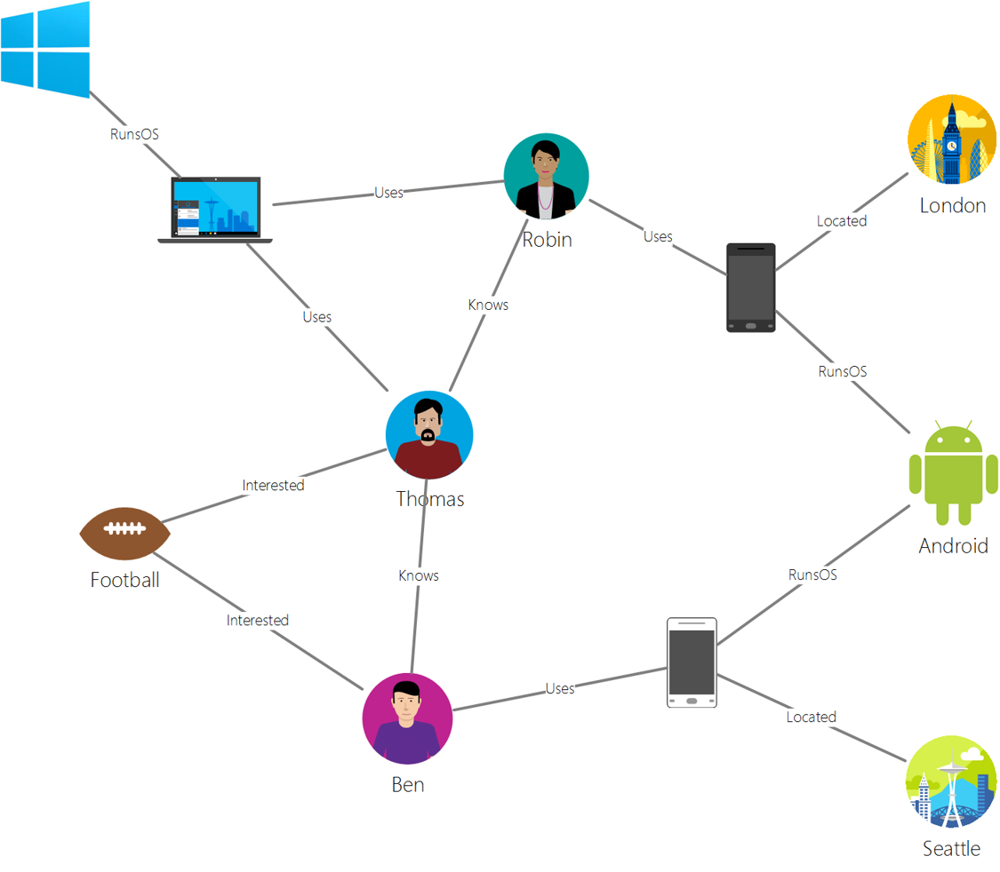
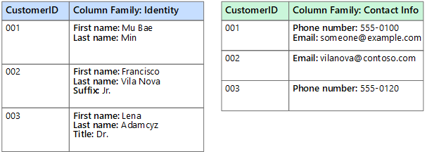

# 데이터 처리: 비-관계형 데이터

| ](../../../sketchnotes/06-NoSQL.png)|
|:---:|
|데이터 처리: NoSQL 데이터 - _Sketchnote by [@nitya](https://twitter.com/nitya)_ |

## [강의 전 퀴즈](https://red-water-0103e7a0f.azurestaticapps.net/quiz/10)

데이터는 관계형 데이터베이스에만 국한되지 않습니다. 이 과정을 통해 비-관계형 데이터에 초점을 맞춰 스프레드시트와 NoSQL의 기초에 대해 설명하겠습니다.

## 스프레드시트

스프레드시트는 설정 및 시작에 필요한 작업량이 적기 때문에 데이터를 저장하거나 탐색하는 일반적인 방법입니다. 이 과정에서는 공식 및 함수뿐만 아니라 스프레드시트의 기본 구성요소에 대해 알아보겠습니다. 예시들은 Microsoft Excel에서 다룰 것이며, 대부분의 다른 스프레드시트 소프트웨어 또한 유사한 이름과 단계들을 가지고 있습니다.


스프레드시트는 하나의 파일이며, 컴퓨터, 장치, 클라우드 기반 파일 시스템에서 접근할 수 있습니다. 소프트웨어 자체로써 브라우저 기반이거나 컴퓨터나 앱에서 다운로드해야 하는 응용 프로그램일 수도 있습니다. 엑셀에서 이러한 파일은 **워크북**이라고 적의되며, 이 과정의 나머지 부분에서 다시 설명하도록 하겠습니다.

워크북은 하나 이상의 **워크시트**가 포함되며, 각 워크시트에는 탭으로 레이블이 지정됩니다. 워크시트에는 **셀**이라 불리는 사각형이 있고, 실제 데이터가 여기에 들어가게 됩니다. 셀은 행과 열의 교차하며 열에는 알파벳 문자의 레이블, 행에는 숫자 레이블이 지정됩니다. 일부 스프레드시트는 처음 몇 행에 셀의 데이터를 설명하는 머릿글이 위치할 수도 있습니다.

엑셀 워크북의 기본 요소를 사용하며 스프레드시트의 몇가지 추가적인 기능을 살펴보기 위해서, 재고를 다루는 [마이크로소프트 템플릿](https://templates.office.com/)에서 제공하는 몇 가지 예제를 사용하겠습니다. 

### 재고 관리

"재고 예시"라는 스프레드시트 파일은 세 개의 워크시트를 가지고 있는 재고 목록의 형식화된 스프레드시트입니다. 탭에는 "재고 목록", "선택한 재고 목록", "Bin 조회" 레이블을 가지고 있습니다. 재고 목록 워크시트의 4행은 각 셀의 값을 설명하는 머리글입니다.


위의 예시 중 어떤 셀은 값을 생성하기 위해 다른 셀의 값에 의존하기도 합니다. 재고 목록 스프레드시트는 재고에 대한 단가는 가지고 있지만, 만약 우리가 재고의 전체적인 비용을 알아야 한다면 어떻게 할까? 이 예에서 [**공식**](https://support.microsoft.com/en-us/office/overview-of-formulas-34519a4e-1e8d-4f4b-84d4-d642c4f63263) 셀 데이터에 대해 계산을 수행하고 재고 비용을 계산하는 데 사용됩니다. 이 스프레드시트는 재고 비용 열의 공식을 사용해 QTY 헤더에 따른 수량과 COST 헤더에 따른 단가를 곱해 각 항목의 값을 계산했습니다. 셀을 두 번 클릭하거나 강조 표시하면 공식이 표시됩니다. 공식은 등호 다음에 계산 또는 연산으로 시작합니다. 


우리는 재고 비용의 모든 값을 더한 총 합계를 구하기 위해 다른 공식을 사용할 수도 있습니다. 총 합계를 계산하기 위해 각각의 셀을 추가해 계산할 수도 있지만, 이것은 너무 지루한 작업입니다. 이 같은 문제를 해결하기 위해 엑셀은 [**함수**](https://support.microsoft.com/en-us/office/sum-function-043e1c7d-7726-4e80-8f32-07b23e057f89), 또는 셀 값에 대한 계산을 수행하기 위한 사전에 정의된 공식을 가지고 있습니다. 함수는 이러한 계산을 수행하는 데 필요한 값인 인수가 필요합니다. 함수에 둘 이상의 인수가 필요한 경우, 인수가 특정 순서로 나열되지 않는다면 올바른 값이 도출되지 않을 수 있습니다. 이 예제에서는 SUM 함수를 사용하겠습니다. 재고 값들을 인수로 사용해, 3행 B열(또는 B3)에 나열된 합계를 추가합니다.

## NoSQL

NoSQL은 비관계적 데이터를 저장하는 다양한 방법을 포괄적으로 지칭하는 용어이며, "비SQL", "비-관계적" 또는 "SQL의 확장"으로 해석될 수 있다. 이러한 유형의 데이터베이스 시스템은 4가지 유형으로 분류할 수 있습니다.


> 출처: [Michał Białecki Blog](https://www.michalbialecki.com/2018/03/18/azure-cosmos-db-key-value-database-cloud/)

[키-값](https://docs.microsoft.com/en-us/azure/architecture/data-guide/big-data/non-relational-data#keyvalue-data-stores) databases pair unique keys, which are a unique identifier associated with a value. These pairs are stored using a [hash table](https://www.hackerearth.com/practice/data-structures/hash-tables/basics-of-hash-tables/tutorial/) with an appropriate hashing function.



> 출처: [Microsoft](https://docs.microsoft.com/en-us/azure/cosmos-db/graph/graph-introduction#graph-database-by-example)

[그래프](https://docs.microsoft.com/en-us/azure/architecture/data-guide/big-data/non-relational-data#graph-data-stores) databases describe relationships in data and are represented as a collection of nodes and edges. A node represents an entity, something that exists in the real world such as a student or bank statement. Edges represent the relationship between two entities  Each node and edge have properties that provides additional information about each node and edges.



[열 기반](https://docs.microsoft.com/en-us/azure/architecture/data-guide/big-data/non-relational-data#columnar-data-stores) data stores organizes data into columns and rows like a relational data structure but each column is divided into groups called a column family, where the all the data under one column is related and can be retrieved and changed in one unit. 


### Document Data Stores with the Azure Cosmos DB 

[Document](https://docs.microsoft.com/en-us/azure/architecture/data-guide/big-data/non-relational-data#document-data-stores) data stores build on the concept of a key-value data store and is made up of a series of fields and objects. This section will explore document databases with the Cosmos DB emulator. 

A Cosmos DB database fits the definition of "Not Only SQL", where Cosmos DB's document database relies on SQL to query the data. The [previous lesson](../../05-relational-databases/README.md) on SQL covers the basics of the language, and we'll be able to apply some of the same queries to a document database here. We'll be using the Cosmos DB Emulator, which allows us to create and explore a document database locally on a computer. Read more about the Emulator [here](https://docs.microsoft.com/en-us/azure/cosmos-db/local-emulator?tabs=ssl-netstd21).

A document is a collection of fields and object values, where the fields describe what the object value represents. Below is an example of a document.

```json
{
    "firstname": "Eva",
    "age": 44,
    "id": "8c74a315-aebf-4a16-bb38-2430a9896ce5",
    "_rid": "bHwDAPQz8s0BAAAAAAAAAA==",
    "_self": "dbs/bHwDAA==/colls/bHwDAPQz8s0=/docs/bHwDAPQz8s0BAAAAAAAAAA==/",
    "_etag": "\"00000000-0000-0000-9f95-010a691e01d7\"",
    "_attachments": "attachments/",
    "_ts": 1630544034
}
```

The fields of interest in this document are: `firstname`, `id`, and `age`. The rest of the fields with the underscores were generated by Cosmos DB.

#### Exploring Data with the Cosmos DB Emulator

You can download and install the emulator [for Windows here](https://aka.ms/cosmosdb-emulator). Refer to this [documentation](https://docs.microsoft.com/en-us/azure/cosmos-db/local-emulator?tabs=ssl-netstd21#run-on-linux-macos) for options on how to run the Emulator for macOS and Linux.

The Emulator launches a browser window, where the Explorer view allows you to explore documents.


If you're following along, click on "Start with Sample" to generate a sample database called SampleDB. If you expand Sample DB by clicking on the arrow you'll find a container called `Persons`, a container holds a collection of items, which are the documents within the container. You can explore the four individual documents under `Items`. 


#### Querying Document Data with the Cosmos DB Emulator

We can also query the sample data by clicking on the new SQL Query button (second button from the left).

`SELECT * FROM c` returns all the documents in the container. Let's add a where clause and find everyone younger than 40.

`SELECT * FROM c where c.age < 40`

 

The query returns two documents, notice the age value for each document is less than 40.

#### JSON and Documents

If you're familiar with JavaScript Object Notation (JSON) you'll notice that documents look similar to JSON. There is a `PersonsData.json` file in this directory with more data that you may upload to the Persons container in the Emulator via the `Upload Item` button.

In most instances, APIs that return JSON data can be directly transferred and stored in document databases. Below is another document, it represents tweets from the Microsoft Twitter account that was retrieved using the Twitter API, then inserted into Cosmos DB.

```json
{
    "created_at": "2021-08-31T19:03:01.000Z",
    "id": "1432780985872142341",
    "text": "Blank slate. Like this tweet if you’ve ever painted in Microsoft Paint before. https://t.co/cFeEs8eOPK",
    "_rid": "dhAmAIUsA4oHAAAAAAAAAA==",
    "_self": "dbs/dhAmAA==/colls/dhAmAIUsA4o=/docs/dhAmAIUsA4oHAAAAAAAAAA==/",
    "_etag": "\"00000000-0000-0000-9f84-a0958ad901d7\"",
    "_attachments": "attachments/",
    "_ts": 1630537000
```

The fields of interest in this document are: `created_at`, `id`, and `text`.

## 🚀 Challenge


There is a `TwitterData.json` file that you can upload to the SampleDB database. It's recommended that you add it to a separate container. This can be done by:

1. Clicking the new container button in the top right
1. Selecting the existing database (SampleDB) creating a container id for the container
1. Setting the partition key to `/id`
1. Clicking OK (you can ignore rest of the information in this view as this is a small dataset running locally on your machine)
1. Open your new container and upload the Twitter Data file with `Upload Item` button

Try to run a few select queries to find the documents that have Microsoft in the text field. Hint: try to use the [LIKE keyword](https://docs.microsoft.com/en-us/azure/cosmos-db/sql/sql-query-keywords#using-like-with-the--wildcard-character)


## [Post-Lecture Quiz](https://red-water-0103e7a0f.azurestaticapps.net/quiz/11)


## Review & Self Study

- There are some additional formatting and features added to this spreadsheet that this lesson does not cover. Microsoft has a [large library of documentation and videos](https://support.microsoft.com/excel) on Excel if you're interested in learning more.

- This architectural documentation details the characteristics in the different types of non-relational data: [Non-relational Data and NoSQL](https://docs.microsoft.com/en-us/azure/architecture/data-guide/big-data/non-relational-data)

- Cosmos DB is a cloud based non-relational database that can also store the different NoSQL types mentioned in this lesson. Learn more about these types in this [Cosmos DB Microsoft Learn Module](https://docs.microsoft.com/en-us/learn/paths/work-with-nosql-data-in-azure-cosmos-db/)

## Assignment

[Soda Profits](assignment.md)
