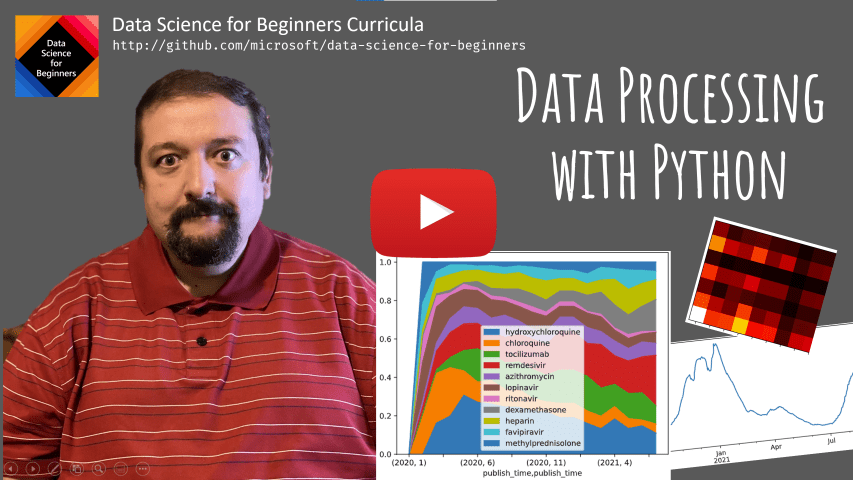
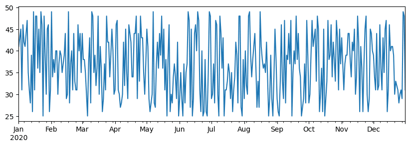
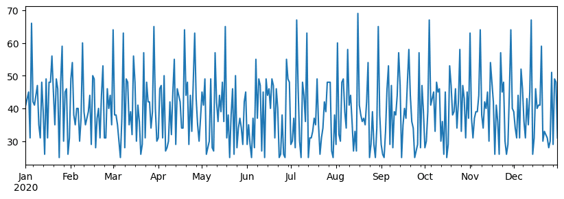
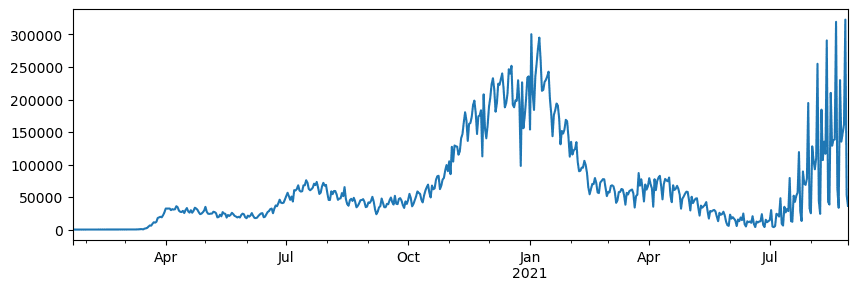
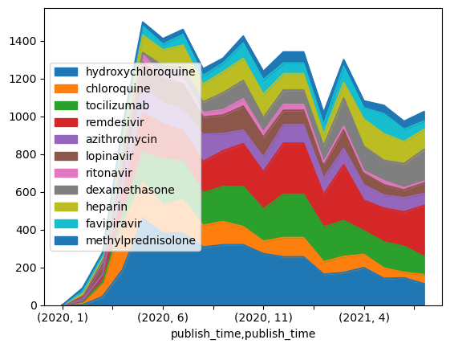

# 데이터 처리: Python and Panda 라이브러리

|  ](../../../sketchnotes/07-WorkWithPython.png) |
| :-------------------------------------------------------------------------------------------------------: |
|                 데이터처리: 파이썬(python) - _Sketchnote by [@nitya](https://twitter.com/nitya)_                 |

[](https://youtu.be/dZjWOGbsN4Y)

데이터베이스가 질의 언어를 사용하여 데이터를 저장하고 쿼리하는 매우 효율적인 방법을 제공하지만, 데이터 처리의 가장 유연한 방법은 데이터를 조작하기 위해 자신만의 프로그램을 작성하는 것입니다. 대부분의 경우 데이터베이스 쿼리를 수행하는 것이 더 효과적인 방법입니다. 그러나 더 복잡한 데이터 처리가 필요한 경우 SQL을 사용하여 쉽게 처리할 수 없습니다.
데이터 처리는 어떤 프로그래밍 언어로도 프로그래밍이 가능하지만, 데이터 작업에 있어서 더 유용한 언어가 있습니다. 데이터 과학자는 일반적으로 다음 언어 중 하나를 선호합니다:

* **[Python(파이썬)](https://www.python.org/)** 은 범용 프로그래밍 언어로 간단하기 때문에 초보자를 위한 최고의 선택지 중 하나입니다. 파이썬(python)에는 ZIP 아카이브에서 데이터를 추출하거나 그림을 흑백으로 변환하는 것과 같은 실제 문제를 해결하는 데 도움이 되는 많은 추가 라이브러리가 존재합니다. 게다가, 데이터 과학 외에도 파이썬은 웹 개발에도 많이 사용됩니다.
* **[R(알)](https://www.r-project.org/)** 은 통계 데이터 처리를 염두에 두고 개발된 전통적인 도구 상자입니다. 또한 대규모 라이브러리 저장소(CRAN)를 포함하고 있어 데이터 처리에 적합합니다. 그러나, R은 범용 프로그래밍 언어가 아니며 데이터 과학 영역 밖에서는 거의 사용되지 않습니다.
* **[Julia(줄리아)](https://julialang.org/)** 데이터 과학을 위해 특별히 개발된 또 다른 언어이다. 이것은 파이썬보다 더 나은 성능을 제공하기 위한 것으로 과학 실험을 위한 훌륭한 도구입니다.

이 과정에서는 간단한 데이터 처리를 위해 파이썬을 사용하는 것에 초점을 맞출 것입니다. 사전에 파이썬에 익숙해질 필요가 있습니다. 파이썬에 대해 더 자세히 살펴보고 싶다면 다음 리소스 중 하나를 참조할 수 있습니다:

* [Turtle Graphics와 Fractal로 Python을 재미있게 배우기](https://github.com/shwars/pycourse) - GitHub 기반 Python 프로그래밍에 대한 빠른 소개 과정
* [Python으로 첫 걸음 내딛기](https://docs.microsoft.com/en-us/learn/paths/python-first-steps/?WT.mc_id=academic-31812-dmitryso) - [Microsoft 학습](http://learn.microsoft.com/?WT.mc_id=academic-31812-dmitryso)으로 이동하기

데이터는 다양한 형태로 나타날 수 있습니다. 이 과정에서 우리는 세 가지 형태의 데이터를 고려할 것입니다. - **표로 나타낸 데이터(tabular data)**, **텍스트(text)** and **이미지(images)**.

모든 관련 라이브러리에 대한 전체 개요를 제공하는 대신 데이터 처리의 몇 가지 예를 중점적으로 살펴보겠습니다. 이를 통해 무엇이 가능한지에 대한 주요 아이디어를 얻을 수 있으며, 필요할 때 문제에 대한 해결책을 찾을 수 있는 방도를 파악할 수 있습니다.

> **유용한 Tip**. 방법을 모르는 데이터에 대해 특정 작업을 수행해야 할 경우 인터넷에서 검색해 보십시오. [스택오버플로우](https://stackoverflow.com/)는 일반적으로 많은 일반적인 작업을 위해 다양한 파이썬의 유용한 코드 샘플을 가지고 있습니다.


## [강의 전 퀴즈](https://red-water-0103e7a0f.azurestaticapps.net/quiz/12)

## 표 형식 데이터 및 데이터 프레임

이전에 관계형 데이터베이스에 대해 이야기할 때 이미 표 형식의 데이터를 다뤘습니다. 데이터가 많고 다양한 테이블이 연결된 경우 SQL을 사용하여 작업하는 것이 좋습니다. 그러나, 데이터 테이블을 가질 때 많은 경우들이 있으며, 우리는 분포, 값들 사이의 상관관계 등과 같이 데이터 자체에 대한 조금의 **이해**나 **통찰력**을 얻을 필요가 있습니다. 데이터 과학에서는 원본 데이터의 일부 변환을 수행한 후 시각화를 수행해야 하는 경우가 많습니다. 이 두 단계는 파이썬을 사용하면 쉽게 수행할 수 있습니다.

파이썬에는 표 형식의 데이터를 처리하는 데 도움이 되는 두 가지 가장 유용한 라이브러리가 있습니다:
* **[Pandas](https://pandas.pydata.org/)** 를 사용하면 관계형 테이블과 유사한 이른바 **데이터 프레임**을 조작할 수 있습니다. 명명된 컬럼을 가질 수 있으며 일반적으로 행,열 및 데이터 프레임에 대해 다양한 작업을 수행할 수 있습니다.
* **[Numpy](https://numpy.org/)** 는 **tensors(텐서)** 작업을 위한 라이브러리 입니다. (예: 다차원 **배열**). 배열은 동일한 기본 유형의 값을 가지며 데이터 프레임보다 간단하지만, 더 많은 수학적 연산을 제공하고 오버헤드를 덜 발생시킵니다.

또한 알아야 할 몇 개의 또 다른 라이브러리들도 있습니다:
* **[Matplotlib](https://matplotlib.org/)** 은 데이터 시각화 및 플롯 그래프에 사용되는 라이브러리입니다.
* **[SciPy](https://www.scipy.org/)** 는 몇 가지 추가적인 과학적 기능을 가진 라이브러리이다. 우리는 확률과 통계에 대해 이야기할 때 이 라이브러리를 사용합니다.

다음은 파이썬 프로그램 시작 부분에서 이러한 라이브러리를 가져오기 위해 일반적으로 사용하는 코드 일부입니다:
```python
import numpy as np
import pandas as pd
import matplotlib.pyplot as plt
from scipy import ... # 필요한 하위 항목을 정확하게 지정해야 합니다.
``` 

Pandas는 몇 가지 기본적인 개념을 중심으로 합니다.

### 시리즈(Series) 

**시리즈(Series)** 은 리스트 또는 numpy 배열과 유사한 일련의 값들입니다. 주요 차이점은 시리즈에도 **색인**이 있고 시리즈에 대해 작업할 때(예: 추가) 인덱스가 고려된다는 것입니다. 인덱스는 정수 행 번호만큼 단순할 수도 있고(목록 또는 배열에서 시리즈를 생성할 때 기본적으로 사용되는 인덱스) 날짜 간격과 같은 복잡한 구조를 가질 수도 있습니다.

> **주의**: 동봉된 [`notebook.ipynb`](notebook.ipynb) 파일에는 몇 가지 Pandas 소개 코드가 있습니다. 여기서는 몇 가지 예시만 간략히 설명하며, 전체 notebook 코드를 확인해 보시기 바랍니다.

예시: 우리는 아이스크림 가게의 매출을 분석하려고 합니다. 일정 기간 동안 일련의 판매 번호(매일 판매되는 품목 수)를 생성해 봅시다.

```python
start_date = "Jan 1, 2020"
end_date = "Mar 31, 2020"
idx = pd.date_range(start_date,end_date)
print(f"Length of index is {len(idx)}")
items_sold = pd.Series(np.random.randint(25,50,size=len(idx)),index=idx)
items_sold.plot()
```


이제 우리가 매주 친구들을 위한 파티를 준비하고, 파티를 위해 아이스크림 10팩을 추가로 가져간다고 가정해 봅시다. 이것을 증명하기 위해 주간별로 색인화된 또 다른 시리즈를 만들 수 있습니다:
```python
additional_items = pd.Series(10,index=pd.date_range(start_date,end_date,freq="W"))
```
두 시리즈를 더하면 총 갯수(total_items)가 나온다:
```python
total_items = items_sold.add(additional_items,fill_value=0)
total_items.plot()
```


> **주의** 지금까지 우리는 `total_control+control_control_control` 이라는 간단한 구문을 사용하지 않고 있습니다. 그랬다면 결과 시리즈에서 많은 `NaN` (*숫자가 아님*) 값을 받았을 것입니다. 이는 `additional_items` 시리즈의 일부 인덱스 포인트에 누락된 값이 있고 항목에 `Nan`을 추가하면 `NaN`이 되기 때문입니다. 따라서 추가하는 동안 'fill_value' 매개변수를 지정해야 합니다.

시계열을 사용하면 다른 시간 간격으로 시리즈를 **리샘플링(resample)**할 수도 있습니다. 예를 들어, 월별 평균 판매량을 계산하려고 한다고 가정합니다. 다음 코드를 사용할 수 있습니다:
```python
monthly = total_items.resample("1M").mean()
ax = monthly.plot(kind='bar')
```


### 데이터프레임

데이터프레임은 기본적으로 동일한 인덱스를 가진 시리즈 모음입니다. 여러 시리즈를 데이터프레임으로 결합할 수 있습니다:
```python
a = pd.Series(range(1,10))
b = pd.Series(["I","like","to","play","games","and","will","not","change"],index=range(0,9))
df = pd.DataFrame([a,b])
```
이렇게 하면 다음과 같은 가로 테이블이 생성됩니다:
|     | 0   | 1    | 2   | 3   | 4      | 5   | 6      | 7    | 8    |
| --- | --- | ---- | --- | --- | ------ | --- | ------ | ---- | ---- |
| 0   | 1   | 2    | 3   | 4   | 5      | 6   | 7      | 8    | 9    |
| 1   | I   | like | to  | use | Python | and | Pandas | very | much |

시리즈를 열로 사용하고 딕셔너리(Dictionary)를 사용하여 열 이름을 지정할 수도 있습니다:
```python
df = pd.DataFrame({ 'A' : a, 'B' : b })
```
위의 코드는 다음과 같은 테이블을 얻을 수 있습니다:

|     | A   | B      |
| --- | --- | ------ |
| 0   | 1   | I      |
| 1   | 2   | like   |
| 2   | 3   | to     |
| 3   | 4   | use    |
| 4   | 5   | Python |
| 5   | 6   | and    |
| 6   | 7   | Pandas |
| 7   | 8   | very   |
| 8   | 9   | much   |

**주의** 또한 이전 표를 바꿔서 이 같은 표 레이아웃을 얻을 수 있습니다.
```python
df = pd.DataFrame([a,b]).T..rename(columns={ 0 : 'A', 1 : 'B' })
```
여기서 `.T`는 행과 열을 변경하는 DataFrame을 전치하는 작업, 즉 행과 열을 변경하는 작업을 의미하며 `rename` 작업을 사용하면 이전 예제와 일치하도록 열 이름을 바꿀 수 있습니다.

다음은 데이터프레임에서 수행할 수 있는 몇 가지 가장 중요한 작업입니다:

**특정 컬럼 선택(Column selection)**. `df['A']`를 작성하여 개별 열을 선택할 수 있습니다. 이 작업은 시리즈를 반환합니다. 또한 `df[['B','A']]`를 작성하여 열의 하위 집합을 다른 데이터프레임으로 선택할 수 있습니다. 그러면 다른 데이터프레임이 반환됩니다.

**필터링(Filtering)** 은 기준에 따라 특정 행만 적용합니다. 예를 들어 `A` 열이 5보다 큰 행만 남기려면 `df[df['A']>5]`라고 쓸 수 있습니다.

> **주의**: 필터링이 작동하는 방식은 다음과 같습니다. 표현식 `df['A']<5`는 원래 시리즈 `df['A']`의 각 요소에 대해 표현식이 `True`인지 아니면 `False`인지를 나타내는 `부울(Boolean)` 시리즈를 반환합니다. 부울 계열이 인덱스로 사용되면 데이터프레임에서 행의 하위 집합을 반환합니다. 따라서 임의의 Python 부울 표현식을 사용할 수 없습니다. 예를 들어 `df[df['A']>5 및 df['A']<7]`를 작성하는 것은 잘못된 것입니다. 대신, 부울 계열에 특수 `&` 연산을 사용하여 `df[(df['A']>5) & (df['A']<7)]`로 작성해야 합니다(*여기서 대괄호가 중요합니다*).

**새로운 계산 가능한 열 만들기**. 우리는 직관적인 표현을 사용하여 데이터프레임에 대한 새로운 계산 가능한 열을 쉽게 만들 수 있습니다.:
```python
df['DivA'] = df['A']-df['A'].mean() 
``` 
이 예제에서는 평균값으로부터 A의 차이를 계산합니다. 여기서 실제로 발생하는 일은 열을 계산하고 왼쪽에 이 열을 할당하여 다른 열을 만드는 것입니다. 따라서 시리즈와 호환되지 않는 연산은 사용할 수 없습니다. 예를 들어 아래와 같은 코드는 잘못되었습니다.:
```python
# 잘못된 코드 -> df['ADescr'] = "Low" if df['A'] < 5 else "Hi"
df['LenB'] = len(df['B']) # <- 잘못된 결과
``` 
위의 예제는 문법적으로는 정확하지만, 우리가 의도한 대로 개별 요소의 길이가 아니라 열의 모든 값에 시리즈 `B`의 길이를 할당하기 때문에 잘못된 결과를 도출합니다.

이와 같이 복잡한 표현식을 계산해야 하는 경우 `apply` 함수를 사용할 수 있습니다. 마지막 예제는 다음과 같이 작성할 수 있습니다:
```python
df['LenB'] = df['B'].apply(lambda x : len(x))
# or 
df['LenB'] = df['B'].apply(len)
```

위의 작업 후에 다음과 같은 데이터프레임이 완성됩니다:

|     | A   | B      | DivA | LenB |
| --- | --- | ------ | ---- | ---- |
| 0   | 1   | I      | -4.0 | 1    |
| 1   | 2   | like   | -3.0 | 4    |
| 2   | 3   | to     | -2.0 | 2    |
| 3   | 4   | use    | -1.0 | 3    |
| 4   | 5   | Python | 0.0  | 6    |
| 5   | 6   | and    | 1.0  | 3    |
| 6   | 7   | Pandas | 2.0  | 6    |
| 7   | 8   | very   | 3.0  | 4    |
| 8   | 9   | much   | 4.0  | 4    |

**숫자를 기준으로 행 선택** `iloc(정수 위치:integer location)` 구성을 사용하여 수행할 수 있습니다. 예를 들어 데이터프레임에서 처음 5개 행을 선택하려면:
```python
df.iloc[:5]
```

**그룹화(Grouping)** 는 종종 Excel의 *피벗 테이블*과 유사한 결과를 얻는 데 사용됩니다. 주어진 `LenB` 수에 대해 `A` 열의 평균 값을 계산하려고 한다고 가정합니다. 그런 다음 `LenB`로 데이터프레임을 그룹화하고 `mean`을 호출할 수 있습니다:
```python
df.groupby(by='LenB').mean()
```
그룹의 요소 수와 평균을 계산해야 하는 경우 더 복잡한 `집계(aggregate)` 함수를 사용할 수 있습니다:
```python
df.groupby(by='LenB') \
 .aggregate({ 'DivA' : len, 'A' : lambda x: x.mean() }) \
 .rename(columns={ 'DivA' : 'Count', 'A' : 'Mean'})
```
This gives us the following table:

| LenB | Count | Mean     |
| ---- | ----- | -------- |
| 1    | 1     | 1.000000 |
| 2    | 1     | 3.000000 |
| 3    | 2     | 5.000000 |
| 4    | 3     | 6.333333 |
| 6    | 2     | 6.000000 |

### 데이터 얻기

우리는 Python 객체에서 시리즈 및 데이터프레임을 구성하는 것이 얼마나 쉬운지 보았습니다. 그러나 데이터는 일반적으로 텍스트 파일 또는 Excel 표의 형태로 제공됩니다. 운 좋게도 Pandas는 디스크에서 데이터를 로드하는 간단한 방법을 제공합니다. 예를 들어 CSV 파일을 읽는 것은 다음과 같이 간단합니다:
```python
df = pd.read_csv('file.csv')
```
"도전(Channenge)" 섹션에서 외부 웹 사이트에서 가져오기를 포함하여 데이터를 로드하는 더 많은 예를 볼 수 있습니다.


### 출력(Printing) 및 플로팅(Plotting)

데이터 과학자는 종종 데이터를 탐색해야 하므로 시각화할 수 있는 것이 중요합니다. 데이터프레임이 클 때 처음 몇 행을 인쇄하여 모든 작업을 올바르게 수행하고 있는지 확인하려는 경우가 많습니다. 이것은 `df.head()`를 호출하여 수행할 수 있습니다. Jupyter Notebook에서 실행하는 경우 데이터프레임을 멋진 표 형식으로 인쇄합니다.

또한 일부 열을 시각화하기 위해 'plot' 함수를 사용하는 것을 보았습니다. `plot`은 많은 작업에 매우 유용하고 `kind=` 매개변수를 통해 다양한 그래프 유형을 지원하지만, 항상 원시 `matplotlib` 라이브러리를 사용하여 더 복잡한 것을 그릴 수 있습니다. 데이터 시각화는 별도의 강의에서 자세히 다룰 것입니다.

이 개요는 Pandas의 가장 중요한 개념을 다루지만 Pandas 라이브러리는 매우 풍부하고 이를 사용하여 수행할 수 있는 작업은 무궁무진합니다! 이제 특정 문제를 해결하기 위해 배운 것을 적용해 보겠습니다.

## 🚀 도전과제 1: 코로나 확산 분석

우리가 초점을 맞출 첫 번째 문제는 COVID-19의 전염병 확산 모델링입니다. 이를 위해 [존 홉킨스 대학](https://jhu.edu/)의 [시스템 과학 및 엔지니어링 센터](https://systems.jhu.edu/)(CSSE)에서 제공하는 여러 국가의 감염자 수 데이터를 사용합니다. 이 [GitHub 레포지토리](https://github.com/CSSEGISandData/COVID-19)에서 데이터 세트를 사용할 수 있습니다.

데이터를 다루는 방법을 보여주고 싶기 때문에 `notebook-covidspread.ipynb`(notebook-covidspread.ipynb)를 열고 위에서 아래로 읽으시기 바랍니다. 셀을 실행할 수도 있고 마지막에 남겨둔 몇 가지 과제를 수행할 수도 있습니다.



> Jupyter Notebook에서 코드를 실행하는 방법을 모르는 경우 [이 기사](https://soshnikov.com/education/how-to-execute-notebooks-from-github/)를 참조하십시오.

## 비정형 데이터 작업

데이터가 표 형식으로 제공되는 경우가 많지만 경우에 따라 텍스트나 이미지와 같이 덜 구조화된 데이터를 처리해야 합니다. 이 경우 위에서 본 데이터 처리 기술을 적용하려면 어떻게든 구조화된 데이터를 **추출(extract)** 해야 합니다. 다음은 몇 가지 예시입니다:

* 텍스트에서 키워드 추출 및 해당 키워드가 나타나는 빈도 확인
* 신경망을 사용하여 그림의 개체에 대한 정보 추출
* 비디오 카메라 피드에서 사람들의 감정에 대한 정보 얻기

## 🚀 도전과제 2: 코로나 논문 분석

이 도전과제에서 우리는 COVID 팬데믹이라는 주제를 계속해서 다룰 것이며 해당 주제에 대한 과학 논문을 처리하는 데 집중할 것입니다. 메타데이터 및 초록과 함께 사용할 수 있는 COVID에 대한 7000개 이상의(작성 당시) 논문이 포함된 [CORD-19 데이터 세트](https://www.kaggle.com/allen-institute-for-ai/CORD-19-research-challenge)가 있습니다(이 중 약 절반에 대해 전체 텍스트도 제공됨). 

[건강 인지 서비스를 위한 텍스트 분석](https://docs.microsoft.com/azure/cognitive-services/text-analytics/how-tos/text-analytics-for-health/?WT.mc_id=academic-31812-dmitryso)를 사용하여 이 데이터 세트를 분석하는 전체 예는 이 블로그 게시물에 설명되어 있습니다. 우리는 이 분석의 단순화된 버전에 대해 논의할 것입니다.

> **주의**: 우리는 더이상 데이터 세트의 복사본을 이 리포지토리의 일부로 제공하지 않습니다. 먼저 [Kaggle의 데이터세트](https://www.kaggle.com/allen-institute-for-ai/CORD-19-research-challenge)에서 [`metadata.csv`](https://www.kaggle.com/allen-institute-for-ai/CORD-19-research-challenge?select=metadata.csv) 파일을 다운로드해야 할 수도 있습니다. Kaggle에 가입해야 할 수 있습니다. [여기](https://ai2-semanticscholar-cord-19.s3-us-west-2.amazonaws.com/historical_releases.html)에서 등록 없이 데이터 세트를 다운로드할 수도 있지만 여기에는 메타데이터 파일 외에 모든 전체 텍스트가 포함됩니다.

[`notebook-papers.ipynb`](notebook-papers.ipynb)를 열고 위에서 아래로 읽으십시오. 셀을 실행할 수도 있고 마지막에 남겨둔 몇 가지 과제를 수행할 수도 있습니다.



## 이미지 데이터 처리

최근에는 이미지를 이해할 수 있는 매우 강력한 AI 모델이 개발되었습니다. 사전에 훈련된 신경망이나 클라우드 서비스를 사용하여 해결할 수 있는 작업이 많이 있습니다. 몇 가지 예는 다음과 같습니다:

* **이미지 분류(Image Classification)** 는 이미지를 미리 정의된 클래스 중 하나로 분류하는 데 도움이 됩니다. [Custom Vision](https://azure.microsoft.com/services/cognitive-services/custom-vision-service/?WT.mc_id=academic-31812-dmitryso)과 같은 서비스를 사용하여 자신의 이미지 분류기를 쉽게 훈련할 수 있습니다.
* **물체 검출** 은 이미지에서 다른 물체를 감지합니다. [컴퓨터 비전(Computer vision)](https://azure.microsoft.com/services/cognitive-services/computer-vision/?WT.mc_id=academic-31812-dmitryso)과 같은 서비스는 여러 일반 개체를 감지할 수 있으며 [커스텀 비전(Custom Vision)](https://azure.microsoft.com/services/cognitive-services/custom-vision-service/?WT.mc_id=academic-31812-dmitryso) 모델을 훈련하여 관심 있는 특정 개체를 감지할 수 있습니다.
* **얼굴 인식** 은 연령, 성별 및 감정 감지를 포함합니다. 이것은 [Face API](https://azure.microsoft.com/services/cognitive-services/face/?WT.mc_id=academic-31812-dmitryso)를 통해 수행할 수 있습니다.

이러한 모든 클라우드 서비스는 [Python SDK](https://docs.microsoft.com/samples/azure-samples/cognitive-services-python-sdk-samples/cognitive-services-python-sdk-samples/?WT.mc_id=academic-31812-dmitryso)를 사용하여 호출할 수 있으므로, 데이터 탐색 워크플로에 쉽게 통합할 수 있습니다.
 
다음은 이미지 데이터 소스에서 데이터를 탐색하는 몇 가지 예입니다:
* 블로그 게시물 중 [코딩 없이 데이터 과학을 배우는 방법](https://soshnikov.com/azure/how-to-learn-data-science-without-coding/)에서 우리는 인스타그램 사진을 살펴보고 사람들이 사진에 더 많은 좋아요를 주는 이유를 이해하려고 합니다. 먼저 [컴퓨터 비전(Computer vision)](https://azure.microsoft.com/services/cognitive-services/computer-vision/?WT.mc_id=academic-31812-dmitryso)을 사용하여 사진에서 최대한 많은 정보를 추출한 다음 [Azure Machine Learning AutoML](https://docs.microsoft.com/azure/machine-learning/concept-automated-ml/?WT.mc_id=academic-31812-dmitryso)을 사용하여 해석 가능한 모델을 빌드합니다.
* [얼굴 연구 워크숍(Facial Studies Workshop)](https://github.com/CloudAdvocacy/FaceStudies)에서는 사람들을 행복하게 만드는 요소를 이해하고자, 이벤트에서 사진에 있는 사람들의 감정을 추출하기 위해 [Face API](https://azure.microsoft.com/services/cognitive-services/face/?WT.mc_id=academic-31812-dmitryso)를 사용합니다.

## 결론

이미 정형 데이터이든 비정형 데이터이든 관계없이 Python을 사용하여 데이터 처리 및 이해와 관련된 모든 단계를 수행할 수 있습니다. 아마도 가장 유연한 데이터 처리 방법일 것이며, 이것이 대부분의 데이터 과학자들이 Python을 기본 도구로 사용하는 이유입니다. 데이터 과학 여정에 대해 진지하게 생각하고 있다면 Python을 깊이 있게 배우는 것이 좋습니다!


## [강의 후 퀴즈](https://red-water-0103e7a0f.azurestaticapps.net/quiz/13)

## 리뷰 & 복습

**책**

* [Wes McKinney. 데이터 분석을 위한 Python: Pandas, NumPy 및 IPython을 사용한 데이터 논쟁(Python for Data Analysis: Data Wrangling with Pandas, NumPy, and IPython)](https://www.amazon.com/gp/product/1491957662)

**온라인 자료**

* 공식 [판다까지 10분(10 minutes to Pandas)](https://pandas.pydata.org/pandas-docs/stable/user_guide/10min.html) tutorial
* [Pandas 시각화에 대한 문서(Documentation on Pandas Visualization)](https://pandas.pydata.org/pandas-docs/stable/user_guide/visualization.html)

**Python 학습**

* [거북이 그래픽과 도형으로 재미있는 방식으로 파이썬 배우기(Learn Python in a Fun Way with Turtle Graphics and Fractals)](https://github.com/shwars/pycourse)
* [파이썬으로 첫걸음(Take your First Steps with Python)](https://docs.microsoft.com/learn/paths/python-first-steps/?WT.mc_id=academic-31812-dmitryso): 관련 강의 [Microsoft 강의](http://learn.microsoft.com/?WT.mc_id=academic-31812-dmitryso)

## 과제

[Perform more detailed data study for the challenges above](../assignment.md)

## 크레딧

본 레슨은 [Dmitry Soshnikov](http://soshnikov.com)님에 의해 작성되었습니다.
