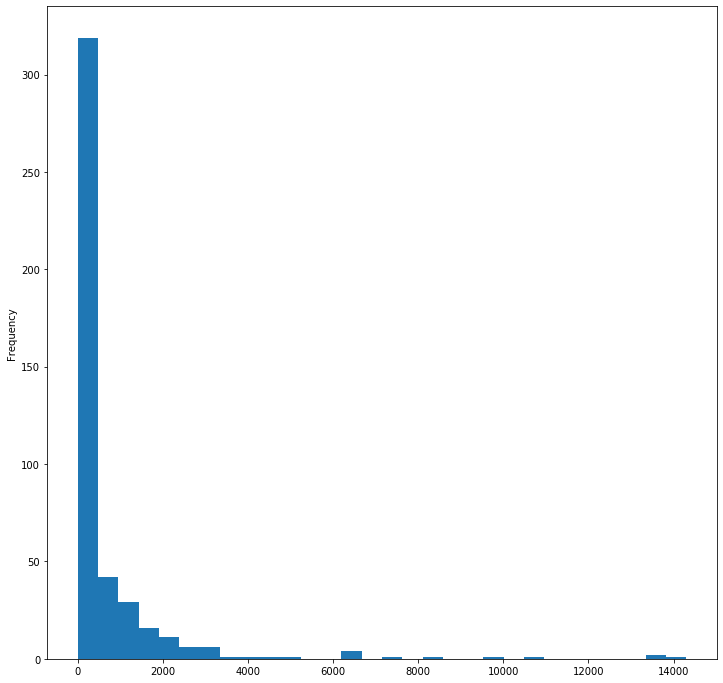
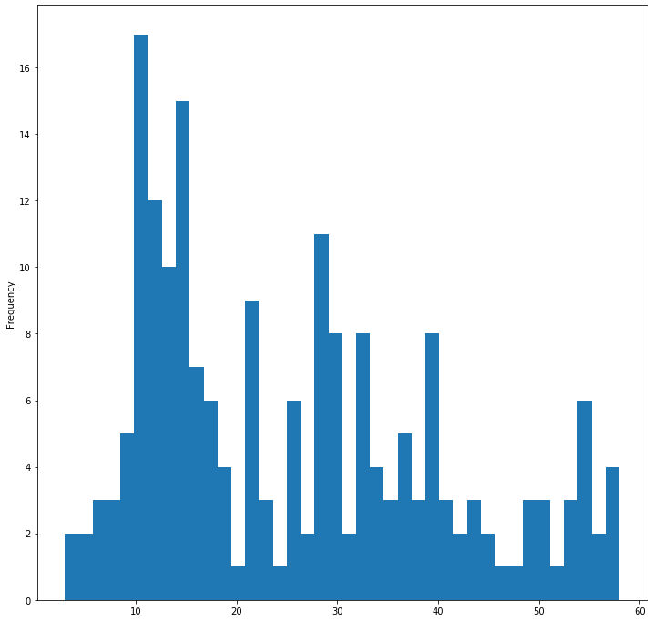
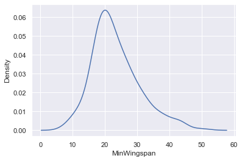

# 분포 시각화하기

| ](../../sketchnotes/10-Visualizing-Distributions.png)|
|:---:|
| 분포 시각화 - _Sketchnote by [@nitya](https://twitter.com/nitya)_ |

이전 수업에서, 미네소타의 새에 대한 데이터셋에 대해서 몇몇 흥미로운 사실들을 배웠습니다. 이상치를 시각화하면서 잘못된 데이터들을 발견하고 새들의 최대 길이에 따라 새 카테고리들의 차이를 살펴보았습니다.

## [강의 전 퀴즈](https://red-water-0103e7a0f.azurestaticapps.net/quiz/18)
## 새 데이터셋 탐색하기

데이터를 자세히 조사하는 또 다른 방법은 데이터의 분포, 또는 데이터가 축에 따라 구성되는 방식을 살펴보는 것입니다. 예를 들어, 미네소타 새들의 최대 날개 길이나 최대 체중의 일반적인 분포에 대해 알고 싶을 수도 있습니다.

이 데이터셋의 데이터 분포에 대한 몇 가지 사실들을 알아보겠습니다. 이 수업 폴더의 루트에 있는 _notebook.ipynb_파일에서 Pandas, Matplotlib 및 데이터를 import합니다:

```python
import pandas as pd
import matplotlib.pyplot as plt
birds = pd.read_csv('../../data/birds.csv')
birds.head()
```

일반적으로, 이전 수업에서와 같이 산점도를 사용하면 데이터가 분포되는 방식을 빠르게 확인할 수 있습니다:

```python
birds.plot(kind='scatter',x='MaxLength',y='Order',figsize=(12,8))

plt.title('Max Length per Order')
plt.ylabel('Order')
plt.xlabel('Max Length')

plt.show()
```
이렇게 하면 새 한 마리당 몸길이의 일반적인 분포에 대한 개요를 제공하지만 실제 분포를 표시하는 최적의 방법은 아닙니다. 이 작업은 보통 히스토그램을 생성하여 처리됩니다.
## 히스토그램으로 작업하기

Matplotlib는 히스토그램을 사용하여 데이터 분포를 시각화하는 매우 좋은 방법을 제공합니다. 이 유형의 차트는 막대의 상승 및 하락을 통해 분포를 확인할 수 있는 막대 차트와 같습니다. 히스토그램을 작성하려면 숫자 데이터가 필요합니다. 히스토그램을 작성하기 위해, 히스토그램의 종류를 'hist'로 정의하는 차트를 표시할 수 있습니다. 이 차트는 전체 데이터셋의 숫자 데이터 범위에 대한 MaxBodyMass 분포를 보여 줍니다. 주어진 데이터의 배열을 더 작은 폭(bins)으로 나누어 데이터 값의 분포를 표시할 수 있습니다:

```python
birds['MaxBodyMass'].plot(kind = 'hist', bins = 10, figsize = (12,12))
plt.show()
```


보시다시피, 이 데이터셋에 있는 400마리 이상의 새들의 대부분은 최대 체질량에서 2000 미만의 범위에 속합니다. 매개 변수 `bins`를 30과 같이 더 높은 숫자로 변경하여 데이터에 대한 더 깊이 이해하세요:

```python
birds['MaxBodyMass'].plot(kind = 'hist', bins = 30, figsize = (12,12))
plt.show()
```


이 차트는 좀 더 세분화된 방식으로 분포를 보여줍니다. 주어진 범위 내에서만 데이터를 선택하여 왼쪽으로 치우치지 않은 차트를 만들 수 있습니다:

데이터를 필터링하여 체중이 60 미만인 새들만 골라서 40개의 `bins`을 표시합니다:

```python
filteredBirds = birds[(birds['MaxBodyMass'] > 1) & (birds['MaxBodyMass'] < 60)]      
filteredBirds['MaxBodyMass'].plot(kind = 'hist',bins = 40,figsize = (12,12))
plt.show()     
```


✅ 다른 필터와 데이터 포인트를 사용해보세요. 데이터의 전체 분포를 보려면, 라벨링된 분포를 표시하도록 `['MaxBodyMass']` 필터를 제거하세요.

히스토그램에서는 다음과 같은 몇 가지 색상 및 레이블 향상 기능도 제공합니다:

2D 히스토그램을 생성하여 두 분포 간의 관계를 비교합니다. `MaxBodyMass`와 `MaxLength`를 비교해보겠습니다. Matplotlib은 더 밝은 색상을 사용하여 수렴을 보여주는 기본 제공 방법을 제공합니다:

```python
x = filteredBirds['MaxBodyMass']
y = filteredBirds['MaxLength']

fig, ax = plt.subplots(tight_layout=True)
hist = ax.hist2d(x, y)
```
예상되는 축을 따라 이 두 요소 사이에는 다음과 같은 특별한 수렴이 있는 것으로 보입니다:


히스토그램은 숫자 데이터에 대해 기본적으로 잘 작동합니다. 텍스트 데이터에 따라 분포를 확인하려면 어떻게 해야 합니까?

## 텍스트 데이터를 사용하여 분포에 대한 데이터셋 탐색하기

이 데이터 세트에는 새 카테고리와 속, 종, 과에 대한 좋은 정보와 보존 상태도 포함되어 있습니다. 이 보존 정보를 자세히 살펴봅시다. 새들의 보존 상태에 따라 분포는 어떻게 되나요?

> ✅ 데이터셋에서 보존 상태를 설명하기 위해 여러 약어가 사용됩니다. 이 약어는 종의 상태를 분류하는 기관인 [IUCN Red List Categories](https://www.iucnredlist.org/)에서 가져왔습니다.
> 
> - CR: 심각한 멸종 위기
> - EN: 멸종 위기에 처한
> - EX: 멸종
> - LC: 관심대상
> - NT: 거의 위협
> - VU: 취약

텍스트 기반 값이므로 히스토그램을 생성하려면 변환을 수행해야 합니다. filteredBirds 데이터프레임을 사용하여 최소 날개 길이과 함께 보존 상태를 표시합니다. 무엇을 볼 수 있습니까? 

```python
x1 = filteredBirds.loc[filteredBirds.ConservationStatus=='EX', 'MinWingspan']
x2 = filteredBirds.loc[filteredBirds.ConservationStatus=='CR', 'MinWingspan']
x3 = filteredBirds.loc[filteredBirds.ConservationStatus=='EN', 'MinWingspan']
x4 = filteredBirds.loc[filteredBirds.ConservationStatus=='NT', 'MinWingspan']
x5 = filteredBirds.loc[filteredBirds.ConservationStatus=='VU', 'MinWingspan']
x6 = filteredBirds.loc[filteredBirds.ConservationStatus=='LC', 'MinWingspan']

kwargs = dict(alpha=0.5, bins=20)

plt.hist(x1, **kwargs, color='red', label='Extinct')
plt.hist(x2, **kwargs, color='orange', label='Critically Endangered')
plt.hist(x3, **kwargs, color='yellow', label='Endangered')
plt.hist(x4, **kwargs, color='green', label='Near Threatened')
plt.hist(x5, **kwargs, color='blue', label='Vulnerable')
plt.hist(x6, **kwargs, color='gray', label='Least Concern')

plt.gca().set(title='Conservation Status', ylabel='Max Body Mass')
plt.legend();
```


최소 날개 길이와 보존 상태 사이에는 좋은 상관 관계가 없어 보입니다. 이 방법을 사용하여 데이터셋의 다른 요소를 테스트합니다. 다른 필터를 시도해 볼 수도 있습니다. 상관관계가 있습니까?

## 밀도분포 그래프

지금까지 살펴본 히스토그램이 '계단형'이며 호를 따라 부드럽게 흐르지 않는다는 것을 눈치채셨을 수도 있습니다. 더 부드러운 밀도 차트를 표시하려면 밀도분포 그래프를 시도할 수 있습니다.

밀도분포 그래프를 사용하려면 새로운 플롯 라이브러리 [Seaborn](https://seaborn.pydata.org/generated/seaborn.kdeplot.html)에 익숙해지세요. 

Seaborn을 로드하고 기본 밀도분포 그래프를 시도하기:

```python
import seaborn as sns
import matplotlib.pyplot as plt
sns.kdeplot(filteredBirds['MinWingspan'])
plt.show()
```


최소 날개 길이 데이터에 대해 이전 그림이 어떻게 반영되는지 확인할 수 있습니다; 조금 더 부드워졌습니다. Seaborn의 문서에 따르면 "히스토그램에 비해 KDE는 특히 다중 분포를 그릴 때 덜 복잡하고 더 해석하기 쉬운 플롯을 생성할 수 있습니다. 그러나 기본 분포가 한정되어 있거나 매끄럽지 않은 경우 왜곡이 있을 가능성이 있습니다. 히스토그램과 마찬가지로 표현의 품질도 좋은 평활화 매개변수(smoothing parameters)의 선택에 따라 달라집니다." [출처](https://seaborn.pydata.org/generated/seaborn.kdeplot.html) 다시 말해, 이상치는 차트를 잘못 작동하게 만듭니다.

두 번째 차트에서 들쭉날쭉한 MaxBodyMass 선을 다시 보고 싶다면, 다음 방법을 사용하여 다시 만들면 매우 부드럽게 만들 수 있습니다:

```python
sns.kdeplot(filteredBirds['MaxBodyMass'])
plt.show()
```


부드럽지만 너무 부드럽지 않은 선을 원하는 경우 `bw_adjust` 매개변수를 편집하세요: 

```python
sns.kdeplot(filteredBirds['MaxBodyMass'], bw_adjust=.2)
plt.show()
```


✅ 이러한 유형의 그림 및 실험에 사용할 수 있는 매개변수에 대해 읽어보세요!

이러한 유형의 차트는 아름답게 설명되는 시각화를 제공합니다. 예를 들어 코드 몇 줄을 사용하여 새 한마리당 최대 체질량 밀도를 표시할 수 있습니다:

```python
sns.kdeplot(
   data=filteredBirds, x="MaxBodyMass", hue="Order",
   fill=True, common_norm=False, palette="crest",
   alpha=.5, linewidth=0,
)
```


여러 변수의 밀도를 하나의 차트에서 보여줄 수도 있습니다. 새의 보존 상태와 비교하여 새의 MaxLength 및 MinLength 텍스트 입력하세요:

```python
sns.kdeplot(data=filteredBirds, x="MinLength", y="MaxLength", hue="ConservationStatus")
```


아마도 이러한 길이에 따른 '취약한' 새들의 무리가 의미가 있는지 없는지 연구해볼 가치가 있을 것입니다.

## 🚀 도전

히스토그램은 기본 산점도, 막대 차트 또는 꺾은선형 차트보다 더 정교한 유형의 차트입니다. 히스토그램 사용의 좋은 예를 찾으려면 인터넷에서 검색해보세요. 어떻게 사용되고, 무엇을 입증하며, 어떤 분야나 조사 분야에서 사용되는 경향이 있습니까?

## [강의 후 퀴즈](https://red-water-0103e7a0f.azurestaticapps.net/quiz/19)

## 복습 & 독학

이 수업에서는 Matplotlib를 사용하고 보다 정교한 차트를 보여주기 위해 Seaborn으로 작업을 시작했습니다. "하나 이상의 차원에서 연속 확률 밀도 곡선"인 Seaborn의 `kdeplot`에 대한 연구를 수행하세요. 작동 방식을 이해하려면 [문서](https://seaborn.pydata.org/generated/seaborn.kdeplot.html)를 읽어보세요.

## 과제

[기술 적용해보기](assignment.md)
