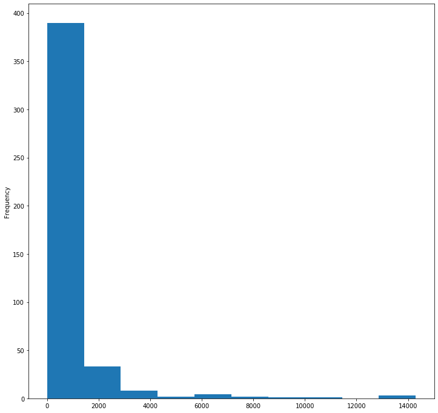
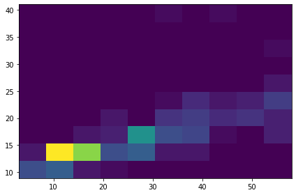
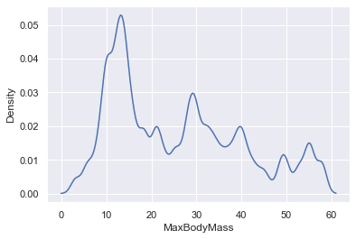
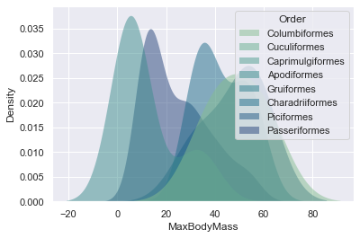
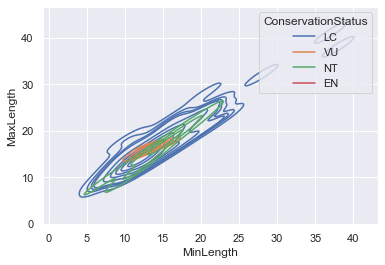

# Visualizando distribuições

| ](../../../sketchnotes/10-Visualizing-Distributions.png)|
|:---:|
| Visualizando distribuições - _Sketchnote por [@nitya](https://twitter.com/nitya)_ |

Na aula anterior, você aprendeu fatos interessantes sobre um dataset de aves de Minnesota. Você encontrou dados incorretos ao visualizar outliers e olhou as diferenças entre categorias de aves com base no seu comprimento máximo.

## [Quiz pré-aula](https://witty-beach-04b13e603.1.azurestaticapps.net/quiz/18)
## Explorando o dataset de aves

Outra forma de explorar os dados é olhar para sua distribuição, ou como os dados estão organizados ao longo do eixo. Por exemplo, talvez você gostaria de aprender sobre a distribuição geral, neste dataset, do máximo de envergadura (wingspan) ou máximo de massa corporal (body mass) das aves de Minnesota.

Vamos descobrir alguns fatos sobre as distribuições de dados neste dataset. No arquivo  _notebook.ipynb_, na raiz do diretório desta aula, importe Pandas, Matplotlib, e os dados:

```python
import pandas as pd
import matplotlib.pyplot as plt
birds = pd.read_csv('../../data/birds.csv')
birds.head()
```

Geralmente, você pode olhar para a forma como os dados estão distribuídos usando um gráfico de dispersão (scatter plot) como fizemos na aula anterior:

```python
birds.plot(kind='scatter',x='MaxLength',y='Order',figsize=(12,8))

plt.title('Max Length per Order')
plt.ylabel('Order')
plt.xlabel('Max Length')

plt.show()
```

Isso nos dá uma visão geral da distribuição de comprimento do corpo por Ordem da ave, mas não é a melhor forma de mostrar a distribuição real. Esta tarefa geralmente é realizada usando um histograma.

## Trabalhando com histogramas

O Matplotlib oferece formas muito boas de visualizar distribuição dos dados usando histogramas. Este tipo de gráfico é parecido com um gráfico de barras onde a distribuição pode ser vista por meio da subida e descida das barras. Para construir um histograma, você precisa de dados numéricos e você pode plotar um gráfico definindo o tipo (kind) como 'hist' para histograma. Este gráfico mostra a distribuição de massa corporal máxima (MaxBodyMass) para todo o intervalo numérico dos dados. Ao dividir um certo vetor de dados em intervalos (bins) menores, vemos a distribuição dos valores:

```python
birds['MaxBodyMass'].plot(kind = 'hist', bins = 10, figsize = (12,12))
plt.show()
```



Como você pode ver, a maior parte das mais de 400 aves cai no intervalo de menos de 2000 para a massa corporal máxima. Obtenha mais conhecimento dos dados mudando o parâmetro de intervalo (`bins`) para um número maior, como 30:

```python
birds['MaxBodyMass'].plot(kind = 'hist', bins = 30, figsize = (12,12))
plt.show()
```


Este gráfico mostra a distribuição de forma mais detalhada. Um gráfico menos concentrado na esquerda pode ser criado garantindo que você só selecione os dados dentro de um certo intervalo:

Filtre seus dados para obter somente as aves que possuem menos de 60 de massa corporal, e mostre 40 intervalos (`bins`):

```python
filteredBirds = birds[(birds['MaxBodyMass'] > 1) & (birds['MaxBodyMass'] < 60)]      
filteredBirds['MaxBodyMass'].plot(kind = 'hist',bins = 40,figsize = (12,12))
plt.show()     
```


✅ Tente outros filtros e pontos de dados (data points). Para ver a distribuição completa dos dados, remova o filtro `['MaxBodyMass']` para mostrar as distribuições com labels (identificadores).

O histograma também oferece algumas cores legais e labels (identificares) melhorados:

Crie um histograma 2D para comparar a relação entre duas distribuições. Vamos comparar massa corporal máxima vs. comprimento máximo (`MaxBodyMass` vs. `MaxLength`). O Matplotlib possui uma forma integrada de mostrar convergência usando cores mais vivas:

```python
x = filteredBirds['MaxBodyMass']
y = filteredBirds['MaxLength']

fig, ax = plt.subplots(tight_layout=True)
hist = ax.hist2d(x, y)
```

Aparentemente, existe uma suposta correlação entre estes dois elementos ao longo de um eixo esperado, com um forte ponto de convergência:



Por definição, os histogramas funcionam para dados numéricos. Mas, e se você precisar ver distribuições de dados textuais?

## Explore o dataset e busque por distribuições usando dados textuais

Este dataset também inclui informações relevantes sobre a categoria de ave e seu gênero, espécie e família, assim como seu status de conservação. Vamos explorar mais a fundo esta informação sobre conservação. Qual é a distribuição das aves de acordo com seu status de conservação?

> ✅ No dataset, são utilizados vários acrônimos para descrever o status de conservação. Estes acrônimos vêm da [IUCN Red List Categories](https://www.iucnredlist.org/), uma organização que cataloga os status das espécies.
> 
> - CR: Critically Endangered (Criticamente em perigo)
> - EN: Endangered (Em perigo)
> - EX: Extinct (Extinto)
> - LC: Least Concern (Pouco preocupante)
> - NT: Near Threatened (Quase ameaçada)
> - VU: Vulnerable (Vulnerável)

Estes são valores textuais, então será preciso transformá-los para criar um histograma. Usando o dataframe filteredBirds, mostre seu status de conservação com sua envergadura mínima (MinWingspan). O que você vê? 

```python
x1 = filteredBirds.loc[filteredBirds.ConservationStatus=='EX', 'MinWingspan']
x2 = filteredBirds.loc[filteredBirds.ConservationStatus=='CR', 'MinWingspan']
x3 = filteredBirds.loc[filteredBirds.ConservationStatus=='EN', 'MinWingspan']
x4 = filteredBirds.loc[filteredBirds.ConservationStatus=='NT', 'MinWingspan']
x5 = filteredBirds.loc[filteredBirds.ConservationStatus=='VU', 'MinWingspan']
x6 = filteredBirds.loc[filteredBirds.ConservationStatus=='LC', 'MinWingspan']

kwargs = dict(alpha=0.5, bins=20)

plt.hist(x1, **kwargs, color='red', label='Extinct')
plt.hist(x2, **kwargs, color='orange', label='Critically Endangered')
plt.hist(x3, **kwargs, color='yellow', label='Endangered')
plt.hist(x4, **kwargs, color='green', label='Near Threatened')
plt.hist(x5, **kwargs, color='blue', label='Vulnerable')
plt.hist(x6, **kwargs, color='gray', label='Least Concern')

plt.gca().set(title='Conservation Status', ylabel='Max Body Mass')
plt.legend();
```


Aparentemente não existe uma correlação forte entre a envergadura mínima e o status de conservação. Teste outros elementos do dataset usando este método. Você também pode tentar outros filtros. Você encontrou alguma correlação?

## Gráfico de densidade (Estimativa de densidade kernel)

Você pode ter percebido que até agora os histogramas são quebrados em degraus e não fluem de forma suave em uma curva. Para mostrar um gráfico de densidade mais 'fluido', você pode tentar usar a estimativa de densidade kernel (kde).

Para trabalhar com gráficos de densidade, acostume-se com uma nova biblioteca de gráficos, o [Seaborn](https://seaborn.pydata.org/generated/seaborn.kdeplot.html). 

Após carregar o Seaborn, tente um gráfico de densidade básico:

```python
import seaborn as sns
import matplotlib.pyplot as plt
sns.kdeplot(filteredBirds['MinWingspan'])
plt.show()
```


Você consegue ver como o gráfico reflete o anterior (de envergadura mínima); só é mais fluido/suave. De acordo com a documentação do Seaborn, "Em comparação com o histograma, o KDE pode produzir um gráfico que é menos confuso e mais legível, especialmente quando plotamos múltiplas distribuições. Mas pode potencialmente introduzir distorções se a distribuição usada é limitada ou não suave. Como um histograma, a qualidade da representação também depende na escolha de bons parâmetros suavizadores (smoothing parameters)." [créditos](https://seaborn.pydata.org/generated/seaborn.kdeplot.html) Em outras palavras, dados discrepantes (outliers) vão fazer seus gráficos se comportarem mal, como sempre.

Se você quer revisitar a linha irregular/dentada MaxBodyMass (massa corporal máxima) no segundo gráfico construído, você pode suavizá-la muito bem recriando o seguinte método:

```python
sns.kdeplot(filteredBirds['MaxBodyMass'])
plt.show()
```


Se você quer uma linha suave, mas não tão suave, mude o parâmetro `bw_adjust`:

```python
sns.kdeplot(filteredBirds['MaxBodyMass'], bw_adjust=.2)
plt.show()
```


✅ Leia sobre os parâmetros disponíveis para este tipo de gráfico e experimente!

Este tipo de gráfico oferece visualizações bonitas e esclarecedoras. Com algumas linhas de código, por exemplo, você pode mostrar a densidade de massa corporal máxima por ave por Ordem:

```python
sns.kdeplot(
   data=filteredBirds, x="MaxBodyMass", hue="Order",
   fill=True, common_norm=False, palette="crest",
   alpha=.5, linewidth=0,
)
```



Você também pode mapear a densidade de várias variáveis em um só gráfico. Teste usar o comprimento máximo (MaxLength) e mínimo (MinLength) de uma ave comparado com seu status de conservação:

```python
sns.kdeplot(data=filteredBirds, x="MinLength", y="MaxLength", hue="ConservationStatus")
```



Talvez valha a pena pesquisar mais a fundo se o cluster de aves vulneráveis ('Vulnerable') de acordo com seus comprimentos têm significado ou não.

## 🚀 Desafio

Histogramas são um tipo mais sofisticado de gráfico em relação a simples gráficos de dispersão, barras ou linhas. Pesquise na internet bons exemplos de uso de histogramas. Como eles são usados, o que eles demonstram e em quais áreas ou campos de pesquisa eles são usados.

## [Post-lecture quiz](https://witty-beach-04b13e603.1.azurestaticapps.net/quiz/19)

## Revisão e autoestudo

Nesta aula, você usou o Matplotlib e começou a trabalhar com o Seaborn para mostrar gráficos mais avançados. Pesquise sobre o `kdeplot` no Seaborn, uma "curva  de densidade de probabilidade contínua em uma ou mais dimensões". Leia a [documentação](https://seaborn.pydata.org/generated/seaborn.kdeplot.html) para entender como funciona.

## Tarefa

[Aplique seus conhecimentos](assignment.pt-br.md)
