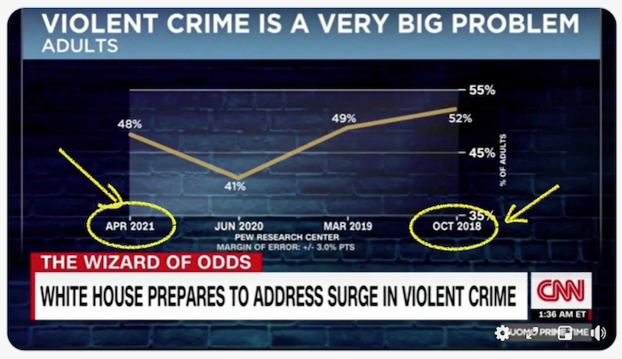
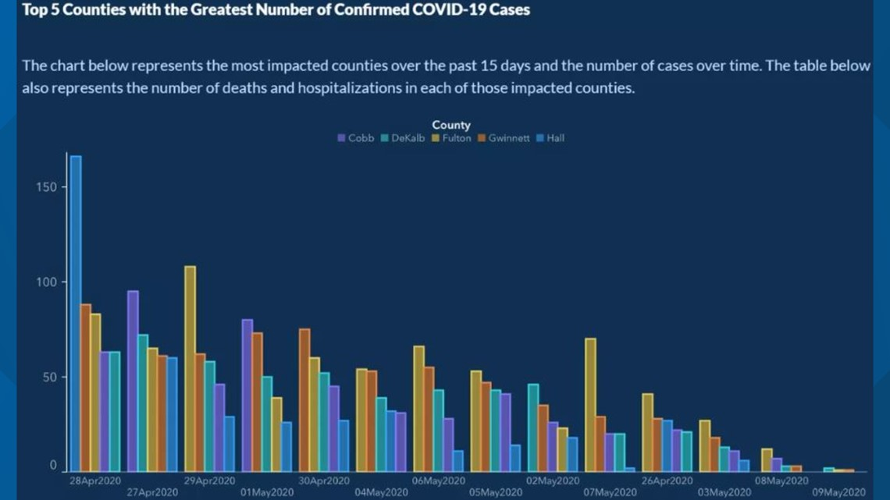
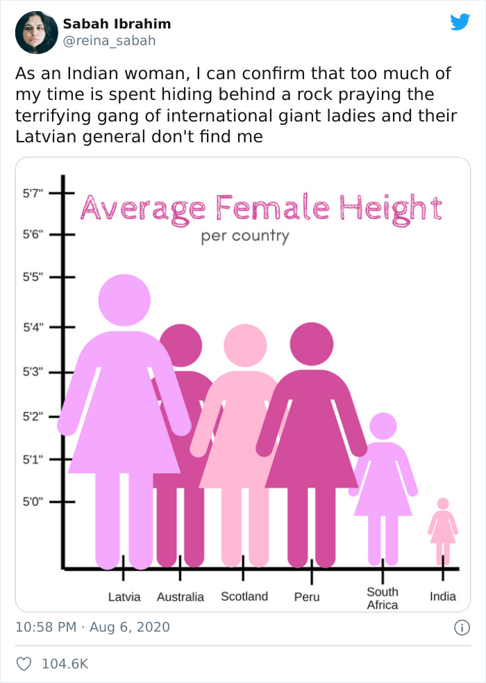
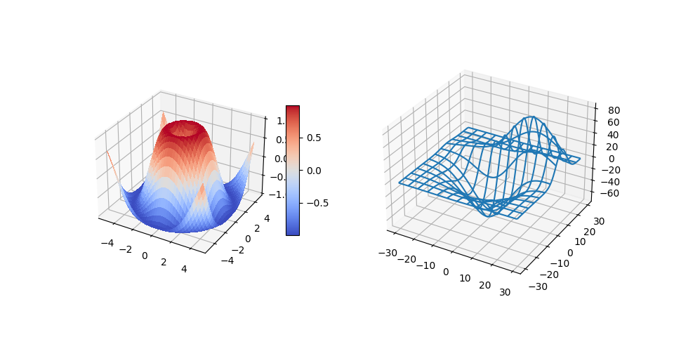
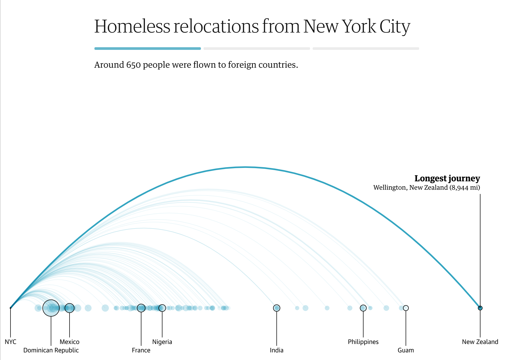
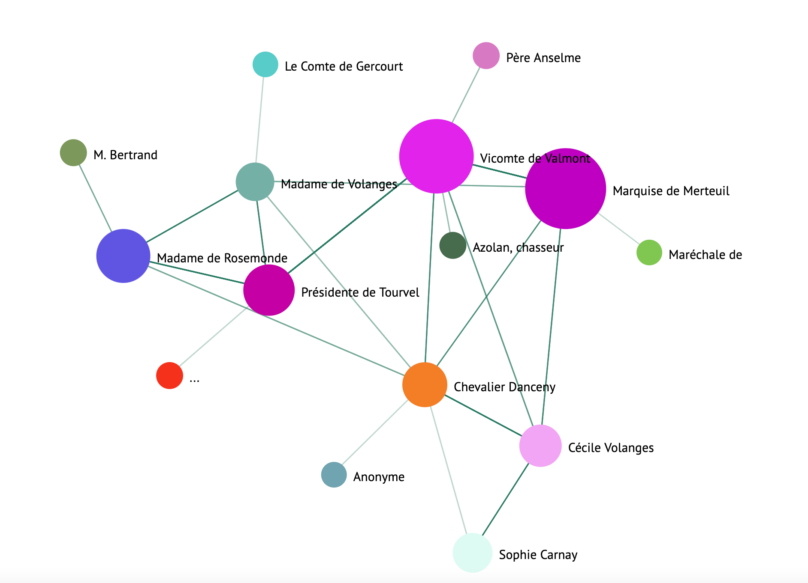

# Haciendo visualizaciones significativas

| ](../../../sketchnotes/13-MeaningfulViz.png)|
|:---:|
| Visualizaciones Significativas - _Sketchnote by [@nitya](https://twitter.com/nitya)_ |

> "Si se torturan los datos el tiempo suficiente, confesarán cualquier cosa" -- [Ronald Coase](https://en.wikiquote.org/wiki/Ronald_Coase)

Una de las habilidades básicas de un científico de datos es la capacidad de crear una visualización de datos significativa que ayude a responder a las preguntas que pueda tener. Antes de visualizar tus datos, tienes que asegurarte de que han sido limpiados y preparados, como hiciste en las lecciones anteriores. Después de eso, puedes empezar a decidir la mejor manera de presentar los datos.

En esta lección, revisarás:

1. Cómo elegir el tipo de gráfico adecuado
2. Cómo evitar los gráficos engañosos
3. Cómo trabajar con el color
4. Cómo estilizar los gráficos para que sean legibles
5. Cómo construir soluciones de gráficos animados o en 3D
6. Cómo construir una visualización creativa

## [Cuestionario previo](https://red-bay-0a991ec0f.1.azurestaticapps.net/quiz/24)

## Elegir el tipo de gráfico adecuado

En las lecciones anteriores, has experimentado con la construcción de todo tipo de visualizaciones de datos interesantes utilizando Matplotlib y Seaborn para la elaboración de gráficos. En general, puedes seleccionar el [tipo de gráfico correcto](https://chartio.com/learn/charts/how-to-select-a-data-vizualization/) para la pregunta que estás haciendo usando esta tabla:

| Debes:                     | Debes usar:                     |
| -------------------------- | ------------------------------- |
| Mostrar las tendencias de los datos a lo largo del tiempo | Lineal |
| Comparar categorías        | Barras, Pastel                        |
| Comparar totales           | Pastel, Barra apilada            |
| Mostrar relaciones         | Dispersión, Línea, Faceta, Línea doble |
| Mostrar distribuciones     | Dispersión, Histograma, Caja         |
| Mostrar proporciones       | Patel, Dona, Waffle              |

> ✅ Dependiendo de la composición de tus datos, es posible que tenga que convertirlos de texto a numéricos para conseguir un gráfico determinado que los soporte.

## Evitar el engaño

Incluso si un científico de datos tiene cuidado de elegir el gráfico adecuado para los datos correctos, hay muchas maneras en que los datos pueden ser mostrados de una manera para demostrar un punto, a menudo a costa de socavar los propios datos. Hay muchos ejemplos de gráficos e infografías engañosos.

[](https://www.youtube.com/watch?v=oX74Nge8Wkw "How charts lie")

> 🎥 Haz clic en la imagen de arriba para ver una conferencia sobre los gráficos engañosos

Este gráfico invierte el eje X para mostrar lo contrario de la verdad, según la fecha:



[Este gráfico](https://media.firstcoastnews.com/assets/WTLV/images/170ae16f-4643-438f-b689-50d66ca6a8d8/170ae16f-4643-438f-b689-50d66ca6a8d8_1140x641.jpg) es aún más engañoso, ya que la mirada se dirige hacia la derecha para concluir que, con el tiempo, los casos de COVID han disminuido en los distintos condados. De hecho, si se observan detenidamente las fechas, se descubre que han sido reordenadas para dar esa engañosa tendencia a la baja.



Este ejemplo notorio utiliza el color Y un eje Y invertido para engañar: en lugar de concluir que las muertes por armas de fuego se dispararon después de la aprobación de la legislación favorable a las armas, en realidad se engaña al ojo para que piense lo contrario:


Este extraño gráfico muestra cómo se puede manipular la proporción, con un efecto hilarante:



Comparar lo incomparable es otro truco turbio. Hay un [maravilloso sitio web](https://tylervigen.com/spurious-correlations) que trata sobre "correlaciones falsas" y muestra "hechos" que correlacionan cosas como la tasa de divorcios en Maine y el consumo de margarina. Un grupo de Reddit también recoge los [usos feos](https://www.reddit.com/r/dataisugly/top/?t=all) de los datos.

Es importante entender lo fácil que es engañar al ojo con gráficos engañosos. Incluso si la intención del científico de datos es buena, la elección de un mal tipo de gráfico, como un gráfico circular que muestre demasiadas categorías, puede ser engañosa.

## Color

En el gráfico sobre la violencia con armas de fuego en Florida, ya has visto cómo el color puede proporcionar un nivel adicional de significado a los gráficos, especialmente a los que no están diseñados con bibliotecas como Matplotlib y Seaborn, que vienen con varias bibliotecas y paletas de colores. Si estás haciendo un gráfico a mano, haz un pequeño estudio de la [teoría del color](https://colormatters.com/color-and-design/basic-color-theory)

> ✅ Al diseñar los gráficos, ten en cuenta que la accesibilidad es un aspecto importante de la visualización. Algunos de sus usuarios pueden ser daltónicos: ¿su gráfico se visualiza bien para los usuarios con problemas de visión?

Tenga cuidado al elegir los colores de su gráfico, ya que el color puede transmitir un significado que quizá no sea el deseado. Las "damas rosas" del gráfico de "altura" de arriba transmiten un significado claramente "femenino" que se suma a la extrañeza del propio gráfico.

Mientras que [el significado del color](https://colormatters.com/color-symbolism/the-meanings-of-colors) puede ser diferente en distintas partes del mundo, y tiende a cambiar de significado según su tonalidad. En general, los significados de los colores incluyen:

| Color | significado  |
| ------ | ------------------- |
| rojo | poder
| azul | confianza, lealtad
| amarillo | felicidad, precaución
| verde | ecología, suerte, envidia |
| púrpura | felicidad |
| naranja | vitalidad |

Si tienes que construir un gráfico con colores personalizados, asegúrese de que tus gráficos sean accesibles y de que el color que elijas coincida con el significado que intentas transmitir.

## Estilizar los gráficos para que sean legibles

Los gráficos no tienen sentido si no son legibles. Tómate un momento para considerar el estilo de la anchura y la altura de tu gráfico para que se ajuste a tus datos. Si es necesario mostrar una variable (como los 50 estados), muéstrela verticalmente en el eje Y si es posible, para evitar un gráfico que se desplace horizontalmente.

Etiqueta tus ejes, proporciona una leyenda si es necesario y ofrece información sobre herramientas para una mejor comprensión de los datos.

Si tus datos son textuales y verbales en el eje X, puedes inclinar el texto para una mejor legibilidad. [Matplotlib](https://matplotlib.org/stable/tutorials/toolkits/mplot3d.html) ofrece gráficos en 3D, si tus datos lo permiten. Se pueden producir sofisticadas visualizaciones de datos utilizando `mpl_toolkits.mplot3d`.



## Animación y visualización de gráficos en 3D

Algunas de las mejores visualizaciones de datos actuales son animadas. Shirley Wu tiene unas increíbles realizadas con D3, como '[film flowers](http://bl.ocks.org/sxywu/raw/d612c6c653fb8b4d7ff3d422be164a5d/)', donde cada flor es una visualización de una película. Otro ejemplo de The Guardian es 'bussed out', una experiencia interactiva que combina visualizaciones con Greensock y D3 más un formato de artículo de scrollytelling para mostrar cómo la ciudad de Nueva York maneja su problema de los sin techo sacando a la gente de la ciudad en autobús.



> "Bussed Out: How America Moves its Homeless" de [the Guardian](https://www.theguardian.com/us-news/ng-interactive/2017/dec/20/bussed-out-america-moves-homeless-people-country-study). Visualizaciones de Nadieh Bremer y Shirley Wu

Aunque esta lección no es suficiente para profundizar en la enseñanza de estas potentes librerías de visualización, prueba a usar D3 en una aplicación Vue.js utilizando una librería para mostrar una visualización del libro "Dangerous Liaisons" como una red social animada.

> "Les Liaisons Dangereuses" es una novela epistolar, o una novela presentada como una serie de cartas. Escrita en 1782 por Choderlos de Laclos, narra las viciosas maniobras sociales de dos protagonistas del duelo de la aristocracia francesa de finales del siglo XVIII, el Vizconde de Valmont y la Marquesa de Merteuil. Ambos acaban muriendo, pero no sin causar un gran daño social. La novela se desarrolla como una serie de cartas escritas a varias personas de sus círculos, tramando una venganza o simplemente creando problemas. Crea una visualización de estas cartas para descubrir los principales protagonistas de la narración, de forma visual.

Completarás una aplicación web que mostrará una vista animada de esta red social. Utiliza una biblioteca construida para crear una [visualización de una red](https://github.com/emiliorizzo/vue-d3-network) utilizando Vue.js y D3. Cuando la aplicación se está ejecutando, se puede tirar de los nodos alrededor de la pantalla para barajar los datos.



## Proyecto: Construir un gráfico para mostrar una red usando D3.js

> Esta carpeta de la lección incluye una carpeta `solution` donde puedes encontrar el proyecto completado, para tu referencia.

1. Sigue las instrucciones del archivo README.md en la raíz de la carpeta de inicio. Asegúrate de que tienes NPM y Node.js funcionando en tu máquina antes de instalar las dependencias del proyecto.

2. Abre la carpeta `starter/src`. Descubrirás una carpeta `assets` donde encontrarás un archivo .json con todas las letras de la novela, numeradas, con una anotación 'to' y 'from'.

3. Completa el código en `components/Nodes.vue` para habilitar la visualización. Busca el método llamado `createLinks()` y añade el siguiente bucle anidado.

Recorre el objeto .json para capturar los datos "to" y "from" de las letras y construye el objeto `links` para que la librería de visualización pueda consumirlo:

```javascript
//loop through letters
      let f = 0;
      let t = 0;
      for (var i = 0; i < letters.length; i++) {
          for (var j = 0; j < characters.length; j++) {
              
            if (characters[j] == letters[i].from) {
              f = j;
            }
            if (characters[j] == letters[i].to) {
              t = j;
            }
        }
        this.links.push({ sid: f, tid: t });
      }
  ```
¡Ejecuta tu app desde la terminal (npm run serve) y disfruta de la visualización!

## 🚀 Reto

Date una vuelta por internet para descubrir visualizaciones engañosas. ¿Cómo engaña el autor al usuario, y, si es intencionado? Intenta corregir las visualizaciones para mostrar cómo deberían ser.

## [Cuestionario posterior a la clase](https://red-bay-0a991ec0f.1.azurestaticapps.net/quiz/25)

## Revisión y Autoestudio

Aquí hay algunos artículos para leer sobre la visualización de datos engañosa:

https://gizmodo.com/how-to-lie-with-data-visualization-1563576606

http://ixd.prattsi.org/2017/12/visual-lies-usability-in-deceptive-data-visualizations/

Eche un vistazo a estas interesantes visualizaciones de activos y artefactos históricos:

https://handbook.pubpub.org/

Mira este artículo sobre cómo la animación puedes mejorar tus visualizaciones:

https://medium.com/@EvanSinar/use-animation-to-supercharge-data-visualization-cd905a882ad4

## Asignación

[Construye tu propia visualización personalizada](assignment.es.md)
