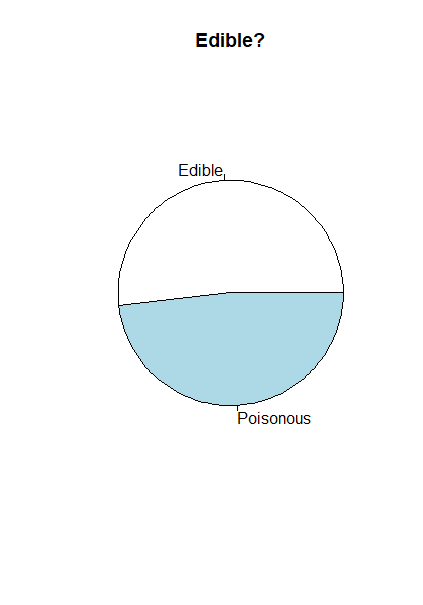
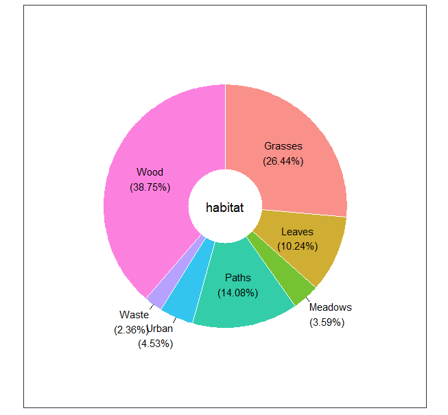
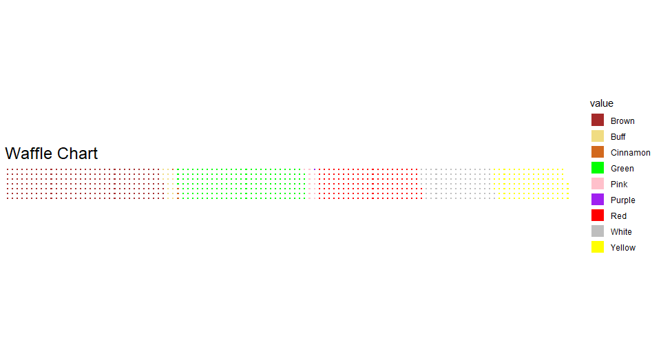

# Visualizing Proportions

| ](../../../sketchnotes/11-Visualizing-Proportions.png)|
|:---:|
|Visualizing Proportions - _Sketchnote by [@nitya](https://twitter.com/nitya)_ |

In this lesson, you will use a different nature-focused dataset to visualize proportions, such as how many different types of fungi populate a given dataset about mushrooms. Let's explore these fascinating fungi using a dataset sourced from Audubon listing details about 23 species of gilled mushrooms in the Agaricus and Lepiota families. You will experiment with tasty visualizations such as:

- Pie charts 🥧
- Donut charts 🍩
- Waffle charts 🧇

> 💡 A very interesting project called [Charticulator](https://charticulator.com) by Microsoft Research offers a free drag and drop interface for data visualizations. In one of their tutorials they also use this mushroom dataset! So you can explore the data and learn the library at the same time: [Charticulator tutorial](https://charticulator.com/tutorials/tutorial4.html).

## [Pre-lecture quiz](https://witty-beach-04b13e603.1.azurestaticapps.net/quiz/20)

## Get to know your mushrooms 🍄

Mushrooms are very interesting. Let's import a dataset to study them:

```r
mushrooms = read.csv('../../data/mushrooms.csv')
head(mushrooms)
```
A table is printed out with some great data for analysis:


| class     | cap-shape | cap-surface | cap-color | bruises | odor    | gill-attachment | gill-spacing | gill-size | gill-color | stalk-shape | stalk-root | stalk-surface-above-ring | stalk-surface-below-ring | stalk-color-above-ring | stalk-color-below-ring | veil-type | veil-color | ring-number | ring-type | spore-print-color | population | habitat |
| --------- | --------- | ----------- | --------- | ------- | ------- | --------------- | ------------ | --------- | ---------- | ----------- | ---------- | ------------------------ | ------------------------ | ---------------------- | ---------------------- | --------- | ---------- | ----------- | --------- | ----------------- | ---------- | ------- |
| Poisonous | Convex    | Smooth      | Brown     | Bruises | Pungent | Free            | Close        | Narrow    | Black      | Enlarging   | Equal      | Smooth                   | Smooth                   | White                  | White                  | Partial   | White      | One         | Pendant   | Black             | Scattered  | Urban   |
| Edible    | Convex    | Smooth      | Yellow    | Bruises | Almond  | Free            | Close        | Broad     | Black      | Enlarging   | Club       | Smooth                   | Smooth                   | White                  | White                  | Partial   | White      | One         | Pendant   | Brown             | Numerous   | Grasses |
| Edible    | Bell      | Smooth      | White     | Bruises | Anise   | Free            | Close        | Broad     | Brown      | Enlarging   | Club       | Smooth                   | Smooth                   | White                  | White                  | Partial   | White      | One         | Pendant   | Brown             | Numerous   | Meadows |
| Poisonous | Convex    | Scaly       | White     | Bruises | Pungent | Free            | Close        | Narrow    | Brown      | Enlarging   | Equal      | Smooth                   | Smooth                   | White                  | White                  | Partial   | White      | One         | Pendant   | Black             | Scattered  | Urban 
| Edible | Convex       |Smooth       | Green     | No Bruises| None   |Free            | Crowded       | Broad     | Black      | Tapering   | Equal      |  Smooth | Smooth                    | White                 | White                  | Partial    | White     | One         | Evanescent | Brown             | Abundant | Grasses
|Edible  |  Convex      | Scaly   | Yellow         | Bruises  | Almond  | Free | Close  |   Broad   |   Brown  | Enlarging   |   Club                      | Smooth                  | Smooth    | White                 |  White                | Partial      | White    |  One  |  Pendant | Black   | Numerous | Grasses
      
Right away, you notice that all the data is textual. You will have to convert this data to be able to use it in a chart. Most of the data, in fact, is represented as an object:

```r
names(mushrooms)
```

The output is:

```output
[1] "class"                    "cap.shape"               
 [3] "cap.surface"              "cap.color"               
 [5] "bruises"                  "odor"                    
 [7] "gill.attachment"          "gill.spacing"            
 [9] "gill.size"                "gill.color"              
[11] "stalk.shape"              "stalk.root"              
[13] "stalk.surface.above.ring" "stalk.surface.below.ring"
[15] "stalk.color.above.ring"   "stalk.color.below.ring"  
[17] "veil.type"                "veil.color"              
[19] "ring.number"              "ring.type"               
[21] "spore.print.color"        "population"              
[23] "habitat"            
```
Take this data and convert the 'class' column to a category:

```r
library(dplyr)
grouped=mushrooms %>%
  group_by(class) %>%
  summarise(count=n())
```


Now, if you print out the mushrooms data, you can see that it has been grouped into categories according to the poisonous/edible class:
```r
View(grouped)
```


| class | count |
| --------- | --------- |
| Edible | 4208 |
| Poisonous| 3916 |


If you follow the order presented in this table to create your class category labels, you can build a pie chart. 

## Pie!

```r
pie(grouped$count,grouped$class, main="Edible?")
```
Voila, a pie chart showing the proportions of this data according to these two classes of mushrooms. It's quite important to get the order of the labels correct, especially here, so be sure to verify the order with which the label array is built!



## Donuts!

A somewhat more visually interesting pie chart is a donut chart, which is a pie chart with a hole in the middle. Let's look at our data using this method.

Take a look at the various habitats where mushrooms grow:

```r
library(dplyr)
habitat=mushrooms %>%
  group_by(habitat) %>%
  summarise(count=n())
View(habitat)
```
The output is:
| habitat| count |
| --------- | --------- |
| Grasses    | 2148 |
| Leaves| 832 |
| Meadows    | 292 |
| Paths| 1144 |
| Urban    | 368 |
| Waste| 192 |
| Wood| 3148 |


Here, you are grouping your data by habitat. There are 7 listed, so use those as labels for your donut chart:

```r
library(ggplot2)
library(webr)
PieDonut(habitat, aes(habitat, count=count))
```



This code uses the two libraries- ggplot2 and webr. Using the PieDonut function of the webr library, we can create a donut chart easily!

Donut charts in R can be made using only the ggplot2 library as well. You can learn more about it [here](https://www.r-graph-gallery.com/128-ring-or-donut-plot.html) and try it out yourself.

Now that you know how to group your data and then display it as a pie or donut, you can explore other types of charts. Try a waffle chart, which is just a different way of exploring quantity.
## Waffles!

A 'waffle' type chart is a different way to visualize quantities as a 2D array of squares. Try visualizing the different quantities of mushroom cap colors in this dataset. To do this, you need to install a helper library called [waffle](https://cran.r-project.org/web/packages/waffle/waffle.pdf) and use it to generate your visualization:

```r
install.packages("waffle", repos = "https://cinc.rud.is")
```

Select a segment of your data to group:

```r
library(dplyr)
cap_color=mushrooms %>%
  group_by(cap.color) %>%
  summarise(count=n())
View(cap_color)
```

Create a waffle chart by creating labels and then grouping your data:

```r
library(waffle)
names(cap_color$count) = paste0(cap_color$cap.color)
waffle((cap_color$count/10), rows = 7, title = "Waffle Chart")+scale_fill_manual(values=c("brown", "#F0DC82", "#D2691E", "green", 
                                                                                     "pink", "purple", "red", "grey", 
                                                                                     "yellow","white"))
```

Using a waffle chart, you can plainly see the proportions of cap colors of this mushrooms dataset. Interestingly, there are many green-capped mushrooms!



In this lesson, you learned three ways to visualize proportions. First, you need to group your data into categories and then decide which is the best way to display the data - pie, donut, or waffle. All are delicious and gratify the user with an instant snapshot of a dataset.

## 🚀 Challenge

Try recreating these tasty charts in [Charticulator](https://charticulator.com).
## [Post-lecture quiz](https://witty-beach-04b13e603.1.azurestaticapps.net/quiz/21)

## Review & Self Study

Sometimes it's not obvious when to use a pie, donut, or waffle chart. Here are some articles to read on this topic:

https://www.beautiful.ai/blog/battle-of-the-charts-pie-chart-vs-donut-chart

https://medium.com/@hypsypops/pie-chart-vs-donut-chart-showdown-in-the-ring-5d24fd86a9ce

https://www.mit.edu/~mbarker/formula1/f1help/11-ch-c6.htm

https://medium.datadriveninvestor.com/data-visualization-done-the-right-way-with-tableau-waffle-chart-fdf2a19be402

Do some research to find more information on this sticky decision.
## Assignment

[Try it in Excel](assignment.md)
