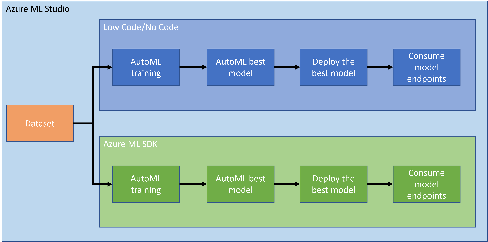
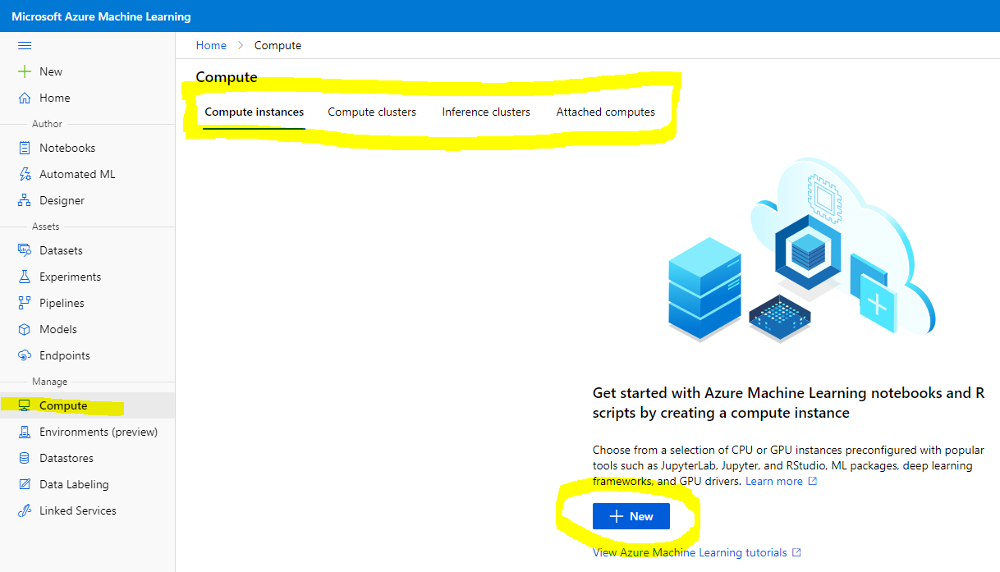

# Data Science in the Cloud: The "Azure ML SDK" way 

Table of contents:

- [Data Science in the Cloud: The "Azure ML SDK" way](#data-science-in-the-cloud-the-azure-ml-sdk-way)
  - [Pre-Lecture Quiz](#pre-lecture-quiz)
  - [1. Introduction](#1-introduction)
    - [1.1 What is Azure ML SDK?](#11-what-is-azure-ml-sdk)
    - [1.2 Heart failure prediction project and dataset introduction](#12-heart-failure-prediction-project-and-dataset-introduction)
  - [2. Training a model with the Azure ML SDK](#2-training-a-model-with-the-azure-ml-sdk)
    - [2.1 Create an Azure ML workspace](#21-create-an-azure-ml-workspace)
    - [2.2 Create a compute instance](#22-create-a-compute-instance)
    - [2.3 Creating Notebooks](#23-creating-notebooks)
  - [🚀 Challenge](#-challenge)
  - [Post-Lecture Quiz](#post-lecture-quiz)
  - [Review & Self Study](#review--self-study)
  - [Assignment](#assignment)
## Pre-Lecture Quiz

[Pre-lecture quiz]()


## 1. Introduction

### 1.1 What is Azure ML SDK?

Data scientists and AI developers use the Azure Machine Learning SDK to build and run machine learning workflows with the Azure Machine Learning service. You can interact with the service in any Python environment, including Jupyter Notebooks, Visual Studio Code, or your favorite Python IDE.

Key areas of the SDK include:

- Explore, prepare and manage the lifecycle of your datasets used in machine learning experiments.
- Manage cloud resources for monitoring, logging, and organizing your machine learning experiments.
- Train models either locally or by using cloud resources, including GPU-accelerated model training.
- Use automated machine learning, which accepts configuration parameters and training data. It automatically iterates through algorithms and hyperparameter settings to find the best model for running predictions.
- Deploy web services to convert your trained models into RESTful services that can be consumed in any application.

[Learn more about the Azure Machine Learning SDK](https://docs.microsoft.com/en-us/python/api/overview/azure/ml/?view=azure-ml-py)

In the [previous lesson](../18-tbd/README.md), we saw how to train, deploy and consume a model in a Low code/No code fashion. We used the Heart Failure dataset to generate and Heart failure prediction model. In this lesson, we are going to do the exact same thing but using the Azure Machine Learning SDK.



### 1.2 Heart failure prediction project and dataset introduction

Check [here](../18-tbd/README.md) the Heart failure prediction project and dataset introduction.

## 2. Training a model with the Azure ML SDK
### 2.1 Create an Azure ML workspace

For simplicity, we are going to work on a jupyter notebook. This implies that you already have a Workspace and a compute instance. If you already have a Workspace, you can directly jump to the section 2.3 Notebook creation.

If not, please follow the instructions in the section **2.1 Create an Azure ML workspace** in the [previous lesson](../18-tbd/README.md) to create a workspace.

### 2.2 Create a compute instance

In the [Azure ML workspace](https://ml.azure.com/) that we created earlier, go to the compute menue and you will see the different compute resources available



Let's create a compute instance to provision a jupyter notebook. 
1. Click on the + New button. 
2. Give a name to your compute instance.
3. Choose your options: CPU or GPU, VM size and core number.
4. Click in the Create button.

Congratulations, you have just created a compute instance! We will use this compute instance to create a Notebook the [Creating Notebooks section](#creating-notebooks)

### 2.3 Creating Notebooks
Notebook are a really important part of the data science process. They can be used to Conduct Exploratory Data Analysis (EDA), call out to a computer cluster to train a model, call out to an inference cluster to deploy an endpoint. 

To create a Notebook, we need a compute node that is serving out the jupyter notebook instance. Go back to the [Azure ML workspace](https://ml.azure.com/) and click on Compute instances. In the list of compute instances you should see the [compute instance we created earlier](#222-creating-compute-resources). 

1. In the Applications section, click on the Jupyter option. 
2. Tick the "Yes, I understand" box and click on the Continue button.

3. This should open a new browser tab with you jupyter notebook instance as follow.


Import the class and create a new workspace by using the following code:

```python
from azureml.core import Workspace
ws = Workspace.create(name='myworkspace',
                      subscription_id='<azure-subscription-id>',
                      resource_group='myresourcegroup',
                      create_resource_group=True,
                      location='eastus2'
                     )
```

## 🚀 Challenge


## Post-Lecture Quiz

[Post-lecture quiz]()

## Review & Self Study


## Assignment

[Assignment Title](assignment.md)


