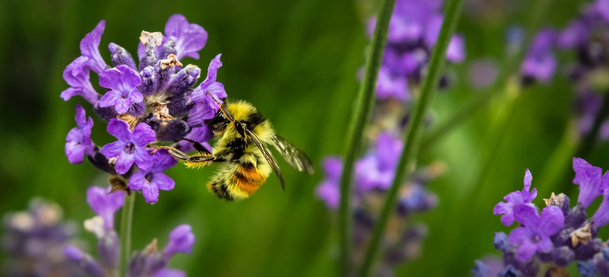

# Visualizations

> Photo by <a href="https://unsplash.com/@jenna2980?utm_source=unsplash&utm_medium=referral&utm_content=creditCopyText">Jenna Lee</a> on <a href="https://unsplash.com/s/photos/bees-in-a-meadow?utm_source=unsplash&utm_medium=referral&utm_content=creditCopyText">Unsplash</a>
  

Visualizing data is one of the most important tasks of a data scientist. Images are worth 1000 words, and a visualization can help you identify all kinds of interesting parts of your data such as spikes, outliers, groupings, tendencies, and more, that can help you understand the story your data is trying to tell. 

In these five lessons, you will explore data sourced from nature and create interesting and beautiful visualizations using various techniques. 

### Topics

1. [Quantities](10-visualization-quantities/README.md)
1. [Distribution](11-visualization-distributions/README.md)
1. [Proportions](12-visualization-proportions/README.md)
1. [Relationships](13-visualization-relationships/README.md)
1. [Making Meaningful Visualizations](14-meaningful-visualizations/README.md)

### Credits

These visualization lessons were written with 🌸 by [Jen Looper](https://twitter.com/jenlooper)

🍯 Data for US Honey Production is sourced from Jessica Li's project on [Kaggle](https://www.kaggle.com/jessicali9530/honey-production). The [data](https://usda.library.cornell.edu/concern/publications/rn301137d) is derived from the [United States Department of Agriculture](https://www.nass.usda.gov/About_NASS/index.php).

🍄 Data for mushrooms is also sourced from [Kaggle](https://www.kaggle.com/hatterasdunton/mushroom-classification-updated-dataset) revised by Hatteras Dunton. This dataset includes descriptions of hypothetical samples corresponding to 23 species of gilled mushrooms in the Agaricus and Lepiota Family Mushroom drawn from The Audubon Society Field Guide to North American Mushrooms (1981). This dataset was donated to UCI ML 27 in 1987.

